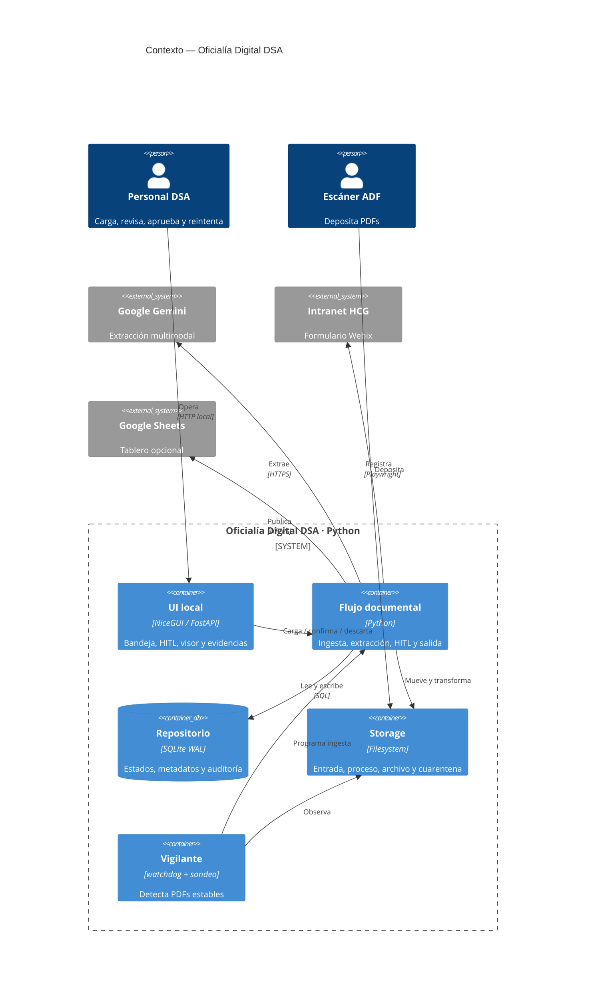
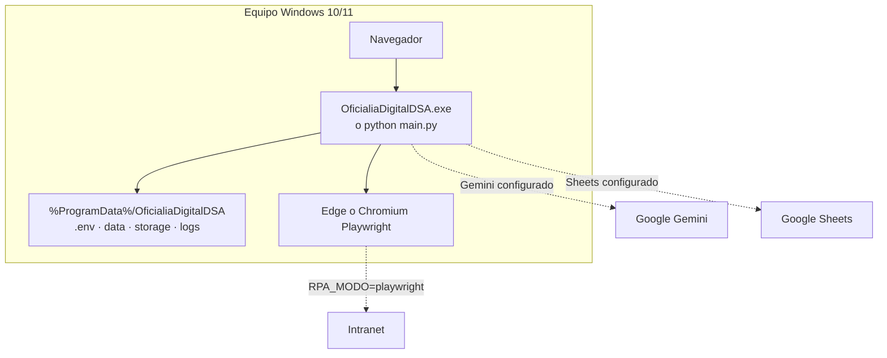
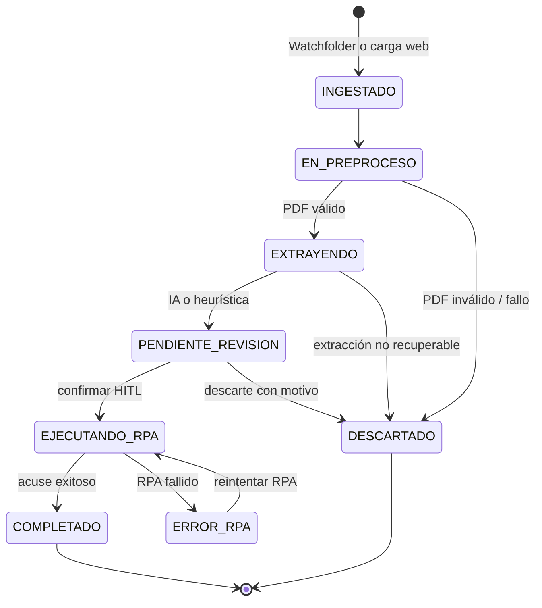

<div align="center">
  
  <h1>Oficialía Digital DSA</h1>
  <p><strong>Recepción, extracción, revisión y registro trazable de oficios PDF.</strong></p>
  <p>
    
    
    
    
    
  </p>
</div>

> [!IMPORTANT]
> **Uso interno.** Plataforma para la División de Servicios Administrativos (DSA) del Hospital Civil de Guadalajara. Proteja los PDFs, evidencias y credenciales conforme a la política institucional.

## Índice

---

## 1. Qué hace el sistema

1. **Ingesta dual de PDFs**: vigilancia automática de `storage/01_entrada/` (escáner ADF, vía
   `watchdog`) y carga manual por la web (arrastrar y soltar). Deduplicación **atómica** por
   SHA-256: un duplicado jamás crea un segundo registro.
2. **Preprocesamiento** con **PyMuPDF** en memoria: validación de cabecera/contraseña/estructura,
   sanitización del árbol xref, conteo de páginas y renderizado a **PNG @300 dpi** (máx. 10
   páginas por inferencia).
3. **Extracción estructurada** con **Gemini 2.5 Flash** (SDK oficial `google-genai`):
   system prompt institucional (protocolo OCR de oficios, 9 secciones), salida JSON forzada y
   validación estricta con **Pydantic v2** (`MetadatosOficio`, 11 campos). Si la IA no está
   disponible (sin API key, cuota agotada, timeout de red), un **extractor heurístico de
   respaldo** (`core/heuristic_extractor.py`, solo regex, sin red) rescata al menos el número
   de oficio y la fecha del texto plano del PDF, para que el documento llegue de todos modos a
   `PENDIENTE_REVISION` — marcado como `HEURISTICA_FALLBACK` — en vez de perderse en cuarentena.
4. **Ciclo de vida persistido en SQLite (WAL)**:
   `INGESTADO → EN_PREPROCESO → EXTRAYENDO → PENDIENTE_REVISION → EJECUTANDO_RPA → COMPLETADO`
   (con `ERROR_RPA` reinteligible y `DESCARTADO` terminal).
5. **Revisión asistida (HITL)** en la web: bandeja con filtros/KPIs/buscador en vivo, **filtro de
   rango de fechas de ingesta** y **split-screen 50/50** — visor de PDF a la izquierda, formulario
   precargado con la IA a la derecha. Acciones: **[Confirmar y Registrar]**, **[Descartar]**,
   **[Reintentar RPA]** y, sobre la bandeja, **[Confirmar seleccionados]** para aprobar en lote
   varios documentos `PENDIENTE_REVISION` a la vez tal cual los extrajo la IA (excluye
   automáticamente los de extracción heurística, que exigen edición manual). Un documento
   extraído por el respaldo heurístico muestra un banner de advertencia imposible de ignorar.
6. **Al confirmar**: renombrado canónico `YYYY-MM-DD__[FOLIO]__[REMITENTE].pdf` en
   `storage/03_procesados/YYYY/MM/` + **respaldo espejo `.json`** + verificación de hash
   post-escritura + **registro de auditoría** (quién confirmó/descartó/reintentó, qué campos
   corrigió respecto de lo extraído — visible como historial en la pantalla de revisión).
7. **RPA con Playwright**: inyección del oficio en la Intranet Webix (`op_cucs.fwx` → iframe
   `op_ningr.fwx`), subida del PDF canónico, captura del **folio de acuse** y screenshot de
   evidencia. Navegador `RPA_NAVEGADOR=auto` (default): usa el Microsoft Edge ya instalado en
   Windows 10/11 sin descargar nada, y solo si no está disponible cae al Chromium empaquetado por
   el instalador. Modo dual `RPA_MODO=simulacion|playwright` y `RPA_HEADLESS=false` para ver el
   navegador.
8. **Sincronización opcional a Google Sheets** (cuenta de servicio) con el layout A:M del tablero
   de control; sin credenciales funciona en **stub local** (`data/sheets_backup.csv`).
9. **Exportación a carpeta compartida de red (SMB)**: al confirmar en HITL, copia (best-effort,
   nunca bloquea el flujo) el PDF canónico a `SMB_EXPORT_DIR` con nombre dinámico
   `{folio}_{fecha}_{remitente}_{asunto}.pdf`; un fallo de permisos o de red en el recurso
   compartido solo queda registrado en el log.
10. **Operación diagnosticable**: log rotativo a archivo (`logs/app.log`, 10 MB × 5 respaldos,
   `core/logging_setup.py`) además de la consola, y esquema SQLite versionado
   (`PRAGMA user_version` + migraciones incrementales en `database.py`) para que actualizar la
   app sobre una instalación existente no corrompa ni pierda la base de datos de un cliente.

---

## Propósito

**Oficialía Digital DSA** es un monolito web local de un solo proceso. Recibe oficios por una carpeta vigilada o la interfaz web, los valida y extrae, pide validación humana (**HITL**), registra los aprobados por RPA y publica un tablero opcional.

| Capacidad | Diseño | Resultado |
|---|---|---|
| 📥 Ingesta | `watchdog` + carga NiceGUI | Escáner ADF o navegador; deduplicación por SHA-256. |
| 🧾 PDF | PyMuPDF + Pillow | Validación, sanitización, render limitado y OCR auxiliar opcional. |
| 🧠 Extracción | Gemini + Pydantic v2 | Contrato de 11 campos; fallback heurístico sobre texto/OCR. |
| 👤 HITL | Bandeja + visor 50/50 | Corrección, confirmación individual/lote y descarte auditable. |
| 🤖 RPA | Playwright o simulación | Registro en Webix, folio de acuse y captura de evidencia. |
| 📊 Tablero | Google Sheets o CSV | La tabulación no bloquea ni revierte un documento completado. |

## Arquitectura

### Contexto y contenedores



### Componentes, aislamiento y concurrencia

```mermaid
flowchart LR
  subgraph Process[Proceso Python · main.py]
    UI[NiceGUI + FastAPI\nBandeja / HITL]
    W[Vigilante\nevento + sondeo]
    I[Executor de ingesta]
    P[FlujoDocumental]
    O[Executor de salida\nRPA serializado]
    R[RepositorioDocumentos]
    F[GestorArchivos]
    A[ExtractorMetadatos]
    X[Adaptador RPA\nsimulación | Playwright]
    Y[SincronizadorSheets]
  end
  PDF[(Storage)] --> W --> I --> P
  UI --> P
  P <--> F <--> PDF
  P <--> R <--> DB[(SQLite WAL)]
  P --> A --> G[Gemini]
  P --> O --> X --> N[Intranet Webix]
  O --> Y --> T[Sheets / CSV]
```

Cada operación de base de datos usa una conexión SQLite corta. WAL, `busy_timeout`, hash único y concurrencia optimista por `version` resguardan las actualizaciones entre hilos. La salida serializa RPA para no competir por sesión/navegador.

### Despliegue



En desarrollo los datos viven en la raíz del repositorio. El ejecutable PyInstaller usa `%ProgramData%\OficialiaDigitalDSA` y reserva `%LOCALAPPDATA%` si la primera ruta no es escribible.

## Ciclo de vida



```mermaid
sequenceDiagram
  autonumber
  participant E as Escáner / Web
  participant P as Flujo
  participant S as Storage
  participant D as SQLite
  participant G as Gemini / heurística
  participant H as Revisor HITL
  participant R as RPA
  participant T as Tablero
  E->>P: PDF + origen
  P->>S: 01_entrada + SHA-256
  P->>D: INGESTADO (hash único)
  P->>S: 02_en_proceso; sanitiza y renderiza
  P->>G: Extrae metadatos tipados
  G-->>P: IA o fallback
  P->>D: PENDIENTE_REVISION
  H->>P: Corrige y confirma
  P->>S: PDF canónico + JSON en 03_procesados
  P->>D: Auditoría + EJECUTANDO_RPA
  P->>R: Salida en segundo plano
  alt Éxito
    R-->>P: Folio + PNG
    P->>D: COMPLETADO
    P->>T: Sheets o CSV
  else Fallo
    R-->>P: Error
    P->>D: ERROR_RPA
  end
```

| Directorio | Uso | Artefactos |
|---|---|---|
| `storage/01_entrada/` | Aterrizaje | PDF original temporal. |
| `storage/02_en_proceso/` | Exclusión de proceso | `<uuid>.pdf`. |
| `storage/03_procesados/YYYY/MM/` | Archivo aprobado | PDF canónico, JSON espejo y evidencias. |
| `storage/04_errores/` | Cuarentena | PDF y `<archivo>.error.txt` sellado. |

### Controles de fiabilidad

| Riesgo | Control |
|---|---|
| Doble ingreso | SHA-256 + `UNIQUE`; el duplicado se aísla. |
| IA no disponible | Reintentos y luego heurística, excepto bloqueos de seguridad. |
| Datos heurísticos | La interfaz los identifica; nunca entran en confirmación por lote. |
| Fallo RPA | `ERROR_RPA` conserva contexto y permite reintento sin reextraer. |
| Fallo Sheets | No revierte `COMPLETADO`; se persiste el resultado o se usa CSV local. |
| Trazabilidad | Auditoría HITL, JSON espejo, cuarentena y evidencias. |

> [!WARNING]
> No hay autenticación propia de aplicación. Ejecute en una estación/red controlada y mantenga `.env`, SQLite, PDFs y capturas fuera de repositorios públicos. Use `RPA_MODO=simulacion` hasta homologar el formulario institucional.

## Inicio rápido

**Requisitos:** Python 3.11+, `pip`, y una clave Gemini solo si se desea extracción IA. Chromium/Edge es necesario únicamente para RPA real.

```bash
python -m venv .venv
source .venv/bin/activate                 # Linux/macOS
# .venv\Scripts\Activate.ps1              # Windows PowerShell
python -m pip install --upgrade pip
pip install -r requirements.txt
touch .env                                 # En Windows, cree .env manualmente
python main.py
```

Abra `http://localhost:8080`. Sin configuración externa, el modo predeterminado es RPA simulado y tablero CSV local.

```dotenv
# .env mínimo
GEMINI_API_KEY=pegue_su_clave
RPA_MODO=simulacion
WATCHFOLDER_ENABLED=true
```

## Configuración

Copie [`.env.example`](.env.example) a `.env`; `config.py` es la fuente única de configuración. Las variables no reconocidas se ignoran. No incluya secretos en el control de versiones.

| Grupo | Variables principales | Predeterminado / efecto sin configurar |
| --- | --- | --- |
| Interfaz | `APP_HOST`, `APP_PORT`, `MAX_UPLOAD_BYTES` | `0.0.0.0`, `8080`, 25 MiB |
| Datos | `DATABASE_PATH`, `STORAGE_ROOT` | `data/oficialia.db` y `storage/` |
| IA | `GEMINI_API_KEY`, `GEMINI_MODELO`, `GEMINI_TIMEOUT_MS`, `GEMINI_REINTENTOS`, `RENDER_DPI`, `RENDER_MAX_PAGINAS` | Sin `GEMINI_API_KEY`, el documento se descarta de forma trazable; modelo `gemini-2.5-flash` |
| Watchfolder | `WATCHFOLDER_ENABLED`, `WATCHFOLDER_INTERVALO_MS`, `WATCHFOLDER_ESTABILIDAD_MS`, `WATCHFOLDER_MAX_REINTENTOS` | Activo, sondeo de respaldo cada 5 s |
| RPA | `RPA_MODO`, `RPA_HEADLESS`, `RPA_TIMEOUT_MS`, `RPA_REINTENTOS`, `RPA_SIMULACION_FALLAR` | `playwright` (real) en esta instalación; fije `RPA_MODO=simulacion` para pruebas locales sin navegador |
| Intranet | `INTRANET_BASE_URL`, `INTRANET_HTTP_USERNAME`, `INTRANET_HTTP_PASSWORD`, `RPA_USUARIO`, `RPA_PASSWORD`, `RPA_OFICIALIA_CVE`, `RPA_HCG_DEPENDENCIA_CVE`, `RPA_SECCION_CVE` | URL institucional configurada en la plantilla; `RPA_USUARIO`/`RPA_PASSWORD` son la cuenta institucional para el login SII/Webix (usadas como HTTP credentials si `INTRANET_HTTP_USERNAME`/`PASSWORD` se omiten) |
| Resiliencia RPA | `RPA_SELECTOR_TIMEOUT_MS`, `RPA_WEBIX_INIT_TIMEOUT_MS`, `RPA_REINTENTO_BASE_MS`, `RPA_REINTENTO_MAX_MS`, `RPA_SESSION_TTL_MIN`, `RPA_JITTER_FACTOR` | Valores seguros internos de `config.py` |
| Exportación SMB | `SMB_EXPORT_DIR` | Copia best-effort del PDF canónico a la carpeta de red al confirmar en HITL; vacío desactiva la exportación |
| Sheets | `GOOGLE_SHEETS_SPREADSHEET_ID`, `GOOGLE_SHEETS_SHEET_NAME`, `GOOGLE_SERVICE_ACCOUNT_JSON` | Sin destino o credenciales se escribe `data/sheets_backup.csv` |

También se admite `GOOGLE_APPLICATION_CREDENTIALS`, o un archivo `credentials.json` junto a los datos de la app, para señalar credenciales de Google fuera del `.env`. Configure al menos `GEMINI_API_KEY` para pasar de ingesta a revisión; para producción, reemplace además `[CONFIGURAR_CREDENCIALES_RPA]` y `[CONFIGURAR_CUENTA_SERVICIO_SHEETS]` según corresponda.

> **Secretos**: `GEMINI_API_KEY`, `RPA_PASSWORD` y `GOOGLE_SERVICE_ACCOUNT_JSON` no tienen valor por
> defecto en `config.py` ni en `.env.example` (ambos se versionan en git) — captúrelos únicamente
> en su `.env` local, que ya está en `.gitignore`.

## Uso de la interfaz y rutas locales

1. Deposite un PDF en `storage/01_entrada/` o cárguelo en la bandeja de `/`.
2. Espere a que alcance `PENDIENTE_REVISION` y abra la revisión.
3. Corrija y confirme los campos extraídos, o descarte el documento con un motivo.
4. Tras confirmar, supervise el resultado `COMPLETADO` o `ERROR_RPA`; este último se puede reintentar sin repetir la extracción.

Las rutas HTTP están destinadas al visor interno de NiceGUI:

| Ruta | Respuesta |
| --- | --- |
| `/` | Bandeja y carga manual de documentos. |
| `/revision/{doc_id}` | Visor PDF y formulario HITL del documento. |
| `/pdf/{doc_id}` | El PDF vigente o `404`. |
| `/evidencia/{doc_id}` | Captura PNG del acuse RPA o `404`. |

Ejemplos de consulta local, usando un identificador existente:

```bash
python -m playwright install chromium
```

Durante homologación, use navegador visible y valide el acuse antes de automatizar sin supervisión.

## Operación

1. Inicie la app y compruebe en `logs/app.log` la carpeta de datos y modos activos.
2. Deposite PDFs en `01_entrada` o cárguelos desde la bandeja.
3. Revise **Pendientes**; toda extracción heurística exige verificación manual.
4. Confirme para archivar PDF/JSON y encolar RPA; los lotes aceptan solo extracción IA.
5. Atienda **Errores RPA** con URL, credenciales, CVE o selectores corregidos y reintente.
6. Respalde `data/`, `storage/` y `logs/` según la política institucional.

| Síntoma | Acción |
|---|---|
| IA descarta | Revise clave, conectividad y log; sin texto extraíble el fallback puede no ser suficiente. |
| Watchfolder inactivo | Confirme permisos, `WATCHFOLDER_ENABLED=true` y estabilidad del archivo. |
| `ERROR_RPA` | Valide URL/credenciales/CVE y cambios Webix con `RPA_HEADLESS=false`. |
| Sin Google Sheets | Revise permisos y Service Account; sin configuración el CSV local es el resultado esperado. |

## Pruebas y empaquetado

```bash
pip install -r requirements.txt -r requirements-dev.txt
pytest -q
```

La suite cubre configuración, modelos, SQLite/migraciones, PDF, heurística y pipeline simulado; no llama a Gemini ni a la Intranet.

| Módulo | Variable | Valores | Sin configurar |
| --- | --- | --- | --- |
| Extracción IA | `GEMINI_API_KEY` | clave real | **Falla honestamente**: documento en `DESCARTADO` con `AI_NO_CONFIGURADA` y archivo en cuarentena (no hay stub de IA para no falsear datos) |
| RPA | `RPA_MODO` | `simulacion` \| `playwright` | `playwright` en esta instalación; `simulacion`: acuse sintético `HCG-OP-SIM-*`, sin navegador |
| RPA navegador (ventana) | `RPA_HEADLESS` | `false` (visible) \| `true` | `false` — ver el navegador al inyectar |
| RPA navegador (motor) | `RPA_NAVEGADOR` | `auto` \| `msedge` \| `chromium` | `auto` — Edge del sistema primero, Chromium empaquetado como respaldo |
| Forzar fallo RPA simulado | `RPA_SIMULACION_FALLAR` | `true` \| `false` | `false` — útiles para ejercitar `ERROR_RPA` + reintento |
| Exportación SMB | `SMB_EXPORT_DIR` | ruta UNC \| vacío | Copia best-effort del PDF canónico al confirmar en HITL; vacío desactiva la exportación |
| Google Sheets | `GOOGLE_SHEETS_SPREADSHEET_ID` + credenciales | Service Account (JSON en una línea, `GOOGLE_APPLICATION_CREDENTIALS` o `credentials.json`) | **Stub local**: `data/sheets_backup.csv` |
| Watchfolder | `WATCHFOLDER_ENABLED` | `true` \| `false` | `true` |

Layout del tablero de Sheets (fila 1 = encabezados, gestionados por usted):
Para generar solamente `dist\OficialiaDigitalDSA` sin requerir Inno Setup:

```powershell
.\packaging\build_windows.ps1
# Solo bundle, sin instalador:
.\packaging\build_windows.ps1 -SinInstalador
```

## Estructura del repositorio

```text
├── main.py                  # Composition root, servidor y ciclo de vida
├── config.py                # Settings y rutas de datos
├── database.py              # SQLite WAL, migraciones y auditoría
├── core/                    # Pipeline, PDF, IA, heurística, storage y watcher
├── rpa/playwright_rpa.py    # Simulación y automatización Webix
├── ui/                      # Bandeja, layout y revisión HITL
├── storage/                 # Artefactos operativos ignorados por Git
├── tests/                   # Suite pytest aislada
└── packaging/               # PyInstaller e Inno Setup
```

---

<div align="center"><strong>Licencia:</strong> propiedad intelectual de la División de Servicios Administrativos del Hospital Civil de Guadalajara. Uso interno restringido.</div>
