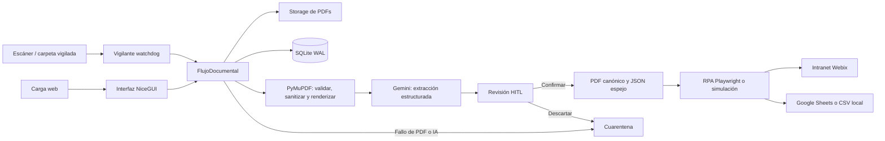
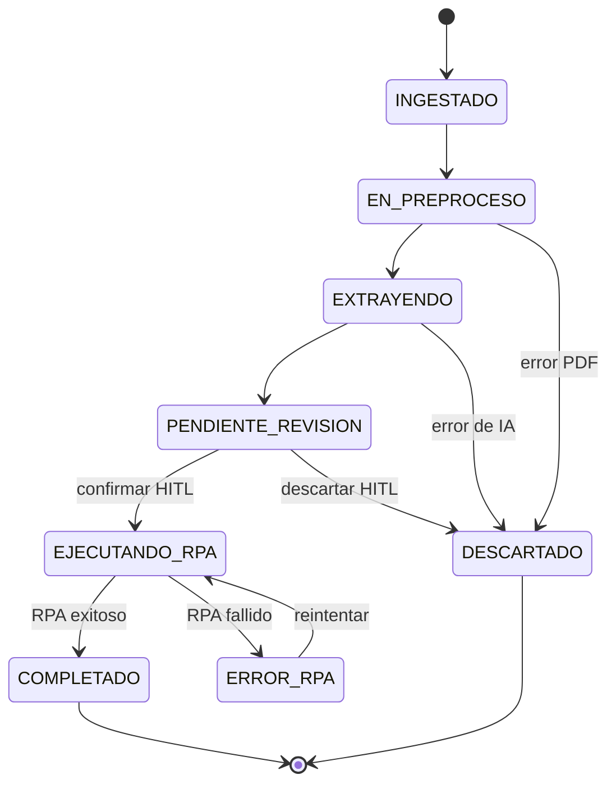

# Oficialía Digital DSA — 100% Python

> **Middleware de Ingesta, Extracción IA y RPA para Gestión Documental**
> Reconstrucción unificada del sistema original (Node.js/Fastify/TypeScript/Svelte 5/WebSockets)
> en **Python puro**, sin sobreingeniería: un proceso, un comando (`python main.py`), cero Node.

**Institución:** División de Servicios Administrativos (DSA) — Hospital Civil de Guadalajara (HCG).

---

## 1. Qué hace el sistema

1. **Ingesta dual de PDFs**: vigilancia automática de `storage/01_entrada/` (escáner ADF, vía
   `watchdog`) y carga manual por la web (arrastrar y soltar). Deduplicación **atómica** por
   SHA-256: un duplicado jamás crea un segundo registro.
2. **Preprocesamiento** con **PyMuPDF** en memoria: validación de cabecera/contraseña/estructura,
   sanitización del árbol xref, conteo de páginas y renderizado a **PNG @300 dpi** (máx. 10
   páginas por inferencia).
3. **Extracción estructurada** con **Gemini 2.5 Flash** (SDK oficial `google-genai`):
   system prompt institucional (protocolo OCR de oficios, 9 secciones), salida JSON forzada y
   validación estricta con **Pydantic v2** (`MetadatosOficio`, 11 campos). Si la IA no está
   disponible (sin API key, cuota agotada, timeout de red), un **extractor heurístico de
   respaldo** (`core/heuristic_extractor.py`, solo regex, sin red) rescata al menos el número
   de oficio y la fecha del texto plano del PDF, para que el documento llegue de todos modos a
   `PENDIENTE_REVISION` — marcado como `HEURISTICA_FALLBACK` — en vez de perderse en cuarentena.
4. **Ciclo de vida persistido en SQLite (WAL)**:
   `INGESTADO → EN_PREPROCESO → EXTRAYENDO → PENDIENTE_REVISION → EJECUTANDO_RPA → COMPLETADO`
   (con `ERROR_RPA` reinteligible y `DESCARTADO` terminal).
5. **Revisión asistida (HITL)** en la web: bandeja con filtros/KPIs/buscador en vivo, **filtro de
   rango de fechas de ingesta** y **split-screen 50/50** — visor de PDF a la izquierda, formulario
   precargado con la IA a la derecha. Acciones: **[Confirmar y Registrar]**, **[Descartar]**,
   **[Reintentar RPA]** y, sobre la bandeja, **[Confirmar seleccionados]** para aprobar en lote
   varios documentos `PENDIENTE_REVISION` a la vez tal cual los extrajo la IA (excluye
   automáticamente los de extracción heurística, que exigen edición manual). Un documento
   extraído por el respaldo heurístico muestra un banner de advertencia imposible de ignorar.
6. **Al confirmar**: renombrado canónico `YYYY-MM-DD__[FOLIO]__[REMITENTE].pdf` en
   `storage/03_procesados/YYYY/MM/` + **respaldo espejo `.json`** + verificación de hash
   post-escritura + **registro de auditoría** (quién confirmó/descartó/reintentó, qué campos
   corrigió respecto de lo extraído — visible como historial en la pantalla de revisión).
7. **RPA con Playwright**: inyección del oficio en la Intranet Webix (`op_cucs.fwx` → iframe
   `op_ningr.fwx`), subida del PDF canónico, captura del **folio de acuse** y screenshot de
   evidencia. Navegador `RPA_NAVEGADOR=auto` (default): usa el Microsoft Edge ya instalado en
   Windows 10/11 sin descargar nada, y solo si no está disponible cae al Chromium empaquetado por
   el instalador. Modo dual `RPA_MODO=simulacion|playwright` y `RPA_HEADLESS=false` para ver el
   navegador.
8. **Sincronización opcional a Google Sheets** (cuenta de servicio) con el layout A:M del tablero
   de control; sin credenciales funciona en **stub local** (`data/tablero_local.csv`).
9. **Operación diagnosticable**: log rotativo a archivo (`logs/app.log`, 10 MB × 5 respaldos,
   `core/logging_setup.py`) además de la consola, y esquema SQLite versionado
   (`PRAGMA user_version` + migraciones incrementales en `database.py`) para que actualizar la
   app sobre una instalación existente no corrompa ni pierda la base de datos de un cliente.

---

## 2. Instalación en Windows (usuario final — sin Python, sin nada que instalar a mano)

Para el personal de la DSA que solo va a **usar** el sistema en un equipo Windows 10/11,
no hace falta clonar el repositorio, instalar Python ni ejecutar `pip install`:

1. Vaya a la pestaña **[Releases](../../releases)** de este repositorio (o a la pestaña
   **Actions → Instalador de Windows → última ejecución → Artifacts**, si aún no hay una
   versión etiquetada) y descargue **`OficialiaDigitalDSA-Setup.exe`**.
2. Ejecútelo y siga el asistente (pide permisos de administrador **solo durante la
   instalación**, para escribir en `Archivos de programa` y crear la carpeta de datos
   compartida). El componente **"Automatización RPA"** (~300 MB, el navegador Chromium)
   es opcional y puede omitirse en la mayoría de los casos: por defecto
   (`RPA_NAVEGADOR=auto`) el RPA real usa primero el Microsoft Edge que Windows 10/11 ya
   trae instalado de fábrica, sin descargar nada — el Chromium empaquetado solo entra como
   respaldo si Edge no está disponible en ese equipo.
3. Al terminar, el propio instalador ofrece abrir la aplicación — el navegador se abre
   solo en `http://127.0.0.1:8080`. También queda un acceso directo en el Escritorio y
   en el menú Inicio.
4. Para extracción real con Gemini (o RPA/Sheets reales), abra
   **Inicio → Oficialía Digital DSA → Configuración (.env)**, capture las claves/credenciales
   necesarias y reinicie la aplicación. **Esto es lo único que el instalador no puede
   resolver por usted**: la API key de Gemini y las credenciales institucionales son
   secretos propios de cada instalación, no dependencias de software.
5. Sin tocar nada, el sistema arranca igualmente en modo seguro: RPA simulado
   (acuses sintéticos `HCG-OP-SIM-*`) y Google Sheets en stub local — sirve para
   explorar la bandeja y el flujo HITL antes de configurar credenciales reales.

Todo queda instalado en `Archivos de programa\OficialiaDigitalDSA\` (código, de solo
lectura) y los datos (`oficialia.db`, PDFs procesados, `.env`) en
`%ProgramData%\OficialiaDigitalDSA\` (con permisos de escritura para el usuario estándar
que ejecuta la app — no requiere privilegios de administrador en el uso diario).
Desinstalar desde *Agregar o quitar programas* **no borra** esa carpeta de datos: la BD y
los PDFs institucionales quedan a salvo.

> **¿Cómo se genera ese instalador?** `packaging/oficialia.spec` (PyInstaller) +
> `packaging/oficialia.iss` (Inno Setup) + `packaging/build_windows.ps1` los ensamblan en
> un único `.exe` que ya trae Python, todas las dependencias de `requirements.txt` y
> (opcionalmente) el navegador Chromium de Playwright — el usuario final nunca instala
> nada de eso por separado. El workflow `.github/workflows/build-windows-installer.yml`
> construye este instalador automáticamente en un runner de Windows de GitHub Actions
> (PyInstaller no compila de forma cruzada) cada vez que se publica un tag `v*`, y lo deja
> tanto como artefacto de la ejecución como adjunto de la Release — nadie necesita un
> equipo Windows propio para publicar una nueva versión. Vea el detalle en
> `packaging/build_windows.ps1`. **No se incluye Tesseract/OCR** (dependencia opcional y
> auxiliar de `core/pdf_engine.py`: el sistema funciona igual sin ella, la extracción
> corre por Gemini) — si el IT institucional lo requiere, puede instalarse aparte.

---

## 3. Arquitectura (monolito modular, un solo proceso)
# Oficialía Digital DSA

> Aplicación monolítica en Python para recibir oficios PDF, extraer metadatos con Gemini, revisarlos por una persona y registrarlos mediante RPA.


## Alcance y arquetipo

**Oficialía Digital DSA** es una aplicación web de gestión documental de proceso único. Expone una interfaz NiceGUI y dos rutas HTTP para servir documentos; no ofrece una API pública de integración. Su punto de entrada es [`main.py`](main.py), ejecutado con `python main.py`.

El sistema recibe PDF desde la carga web o desde una carpeta vigilada, valida y renderiza el archivo, solicita metadatos estructurados a Gemini, exige su validación *human-in-the-loop* (HITL), y finalmente registra el oficio mediante RPA o un simulador. SQLite conserva el estado y Google Sheets recibe una réplica no bloqueante cuando el registro RPA tiene éxito.

| Área | Implementación |
| --- | --- |
| Runtime | Python 3.11+ |
| Interfaz y servidor | NiceGUI, FastAPI/Starlette y Uvicorn (dependencias transitivas de NiceGUI) |
| Validación y configuración | Pydantic 2 y pydantic-settings |
| Persistencia | SQLite con WAL |
| Procesamiento PDF | PyMuPDF y Pillow; OCR auxiliar opcional con Tesseract/pytesseract |
| IA | `google-genai`, modelo configurable (por defecto `gemini-2.5-flash`) |
| Automatización | Playwright contra la Intranet Webix, con modo simulación |
| Tablero externo | Google Sheets mediante gspread y una cuenta de servicio |
| Empaquetado Windows | PyInstaller e Inno Setup |

## Arquitectura y flujo operativo



El flujo persiste los documentos y sus metadatos relacionados en una única tabla `documentos`. Las conexiones a SQLite son cortas y configuran WAL, `busy_timeout` y control de concurrencia optimista por versión. El SHA-256 del archivo tiene una restricción única para impedir duplicados entre los canales web y escáner.

### Ciclo de vida



Los archivos recorren `storage/01_entrada`, `storage/02_en_proceso`, `storage/03_procesados` y `storage/04_errores`. La confirmación HITL mueve el PDF a la ubicación canónica y genera su JSON espejo; los errores se aíslan con un archivo `.error.txt` asociado.

## Inicio rápido desde código fuente

### Prerrequisitos

- Python **3.11 o superior** con `venv` y `pip`.
- Una clave de Gemini para completar la extracción real: `[CONFIGURAR_GEMINI_API_KEY]`.
- Solo para `RPA_MODO=playwright`: acceso a la Intranet, credenciales si aplican y Chromium de Playwright.
- Solo para Google Sheets: ID de hoja y credenciales de cuenta de servicio.

### Instalación y ejecución

```bash
python -m venv .venv
source .venv/bin/activate
# En Windows PowerShell: .venv\Scripts\Activate.ps1

pip install -r requirements.txt
cp .env.example .env
python main.py
```

Abra `http://localhost:8080` si conserva el valor predeterminado de `APP_PORT`. La aplicación crea las carpetas de almacenamiento y la base de datos al iniciar.

Para usar automatización real, instale el navegador administrado por Playwright después de instalar las dependencias:

```bash
playwright install chromium
```

En desarrollo, los datos se almacenan bajo la raíz del repositorio. En el ejecutable Windows empaquetado, se usan `%ProgramData%\OficialiaDigitalDSA` o, como reserva, `%LOCALAPPDATA%\OficialiaDigitalDSA`.

## Configuración

Copie [`.env.example`](.env.example) a `.env`; `config.py` es la fuente única de configuración. Las variables no reconocidas se ignoran. No incluya secretos en el control de versiones.

| Grupo | Variables principales | Predeterminado / efecto sin configurar |
| --- | --- | --- |
| Interfaz | `APP_HOST`, `APP_PORT`, `MAX_UPLOAD_BYTES` | `0.0.0.0`, `8080`, 25 MiB |
| Datos | `DATABASE_PATH`, `STORAGE_ROOT` | `data/oficialia.db` y `storage/` |
| IA | `GEMINI_API_KEY`, `GEMINI_MODELO`, `GEMINI_TIMEOUT_MS`, `GEMINI_REINTENTOS`, `RENDER_DPI`, `RENDER_MAX_PAGINAS` | Sin `GEMINI_API_KEY`, el documento se descarta de forma trazable; modelo `gemini-2.5-flash` |
| Watchfolder | `WATCHFOLDER_ENABLED`, `WATCHFOLDER_INTERVALO_MS`, `WATCHFOLDER_ESTABILIDAD_MS`, `WATCHFOLDER_MAX_REINTENTOS` | Activo, sondeo de respaldo cada 5 s |
| RPA | `RPA_MODO`, `RPA_HEADLESS`, `RPA_TIMEOUT_MS`, `RPA_REINTENTOS`, `RPA_SIMULACION_FALLAR` | `simulacion`, sin navegador real |
| Intranet | `INTRANET_BASE_URL`, `INTRANET_HTTP_USERNAME`, `INTRANET_HTTP_PASSWORD`, `RPA_OFICIALIA_CVE`, `RPA_HCG_DEPENDENCIA_CVE`, `RPA_SECCION_CVE` | URL institucional configurada en la plantilla; credenciales y CVE vacíos |
| Resiliencia RPA | `RPA_SELECTOR_TIMEOUT_MS`, `RPA_WEBIX_INIT_TIMEOUT_MS`, `RPA_REINTENTO_BASE_MS`, `RPA_REINTENTO_MAX_MS`, `RPA_SESSION_TTL_MIN`, `RPA_JITTER_FACTOR` | Valores seguros internos de `config.py` |
| Sheets | `GOOGLE_SHEETS_SPREADSHEET_ID`, `GOOGLE_SHEETS_SHEET_NAME`, `GOOGLE_SERVICE_ACCOUNT_JSON` | Sin destino o credenciales se escribe `data/tablero_local.csv` |

También se admite `GOOGLE_APPLICATION_CREDENTIALS` para señalar un archivo de credenciales de Google fuera del `.env`. Configure al menos `GEMINI_API_KEY` para pasar de ingesta a revisión; para producción, reemplace además `[CONFIGURAR_CREDENCIALES_RPA]` y `[CONFIGURAR_CUENTA_SERVICIO_SHEETS]` según corresponda.

## Uso de la interfaz y rutas locales

1. Deposite un PDF en `storage/01_entrada/` o cárguelo en la bandeja de `/`.
2. Espere a que alcance `PENDIENTE_REVISION` y abra la revisión.
3. Corrija y confirme los campos extraídos, o descarte el documento con un motivo.
4. Tras confirmar, supervise el resultado `COMPLETADO` o `ERROR_RPA`; este último se puede reintentar sin repetir la extracción.

Las rutas HTTP están destinadas al visor interno de NiceGUI:

| Ruta | Respuesta |
| --- | --- |
| `/` | Bandeja y carga manual de documentos. |
| `/revision/{doc_id}` | Visor PDF y formulario HITL del documento. |
| `/pdf/{doc_id}` | El PDF vigente o `404`. |
| `/evidencia/{doc_id}` | Captura PNG del acuse RPA o `404`. |

Ejemplos de consulta local, usando un identificador existente:

```bash
curl -OJ http://localhost:8080/pdf/<doc_id>
curl -o acuse.png http://localhost:8080/evidencia/<doc_id>
```

## Construcción del instalador Windows

La distribución para Windows se construye **en Windows**; PyInstaller no realiza compilación cruzada. El script crea un entorno de construcción, instala requisitos y PyInstaller, descarga Chromium, genera el bundle y compila el instalador con Inno Setup.

### 5.6 Ejecutar la suite de pruebas

```bash
pip install -r requirements-dev.txt
pytest -q
```

No requiere `GEMINI_API_KEY`, Playwright ni Tesseract: cada prueba usa su propia
carpeta temporal (BD SQLite + storage aislados, `tests/conftest.py`) y dobles
(fakes) explícitos donde haría falta un servicio externo — nunca golpea Gemini,
la Intranet real ni internet. Cobertura actual: contrato `MetadatosOficio`
(normalización, centinela `S/N`, nomenclatura canónica), repositorio SQLite
(CRUD, concurrencia optimista, **migraciones de esquema**, el buscador de la
bandeja), preprocesamiento PyMuPDF, el extractor heurístico de respaldo
(sección 1) y la integración completa del pipeline de ingesta con un extractor
de IA simulado. `pytest.ini` fija `testpaths = tests`.

---
```powershell
.\packaging\build_windows.ps1
```

## 6. Modos de operación

| Módulo | Variable | Valores | Sin configurar |
| --- | --- | --- | --- |
| Extracción IA | `GEMINI_API_KEY` | clave real | **Falla honestamente**: documento en `DESCARTADO` con `AI_NO_CONFIGURADA` y archivo en cuarentena (no hay stub de IA para no falsear datos) |
| RPA | `RPA_MODO` | `simulacion` \| `playwright` | `simulacion`: acuse sintético `HCG-OP-SIM-*`, sin navegador |
| RPA navegador (ventana) | `RPA_HEADLESS` | `false` (visible) \| `true` | `false` — ver el navegador al inyectar |
| RPA navegador (motor) | `RPA_NAVEGADOR` | `auto` \| `msedge` \| `chromium` | `auto` — Edge del sistema primero, Chromium empaquetado como respaldo |
| Forzar fallo RPA simulado | `RPA_SIMULACION_FALLAR` | `true` \| `false` | `false` — útiles para ejercitar `ERROR_RPA` + reintento |
| Google Sheets | `GOOGLE_SHEETS_SPREADSHEET_ID` + credenciales | Service Account (JSON en una línea o `GOOGLE_APPLICATION_CREDENTIALS`) | **Stub local**: `data/tablero_local.csv` |
| Watchfolder | `WATCHFOLDER_ENABLED` | `true` \| `false` | `true` |

Layout del tablero de Sheets (fila 1 = encabezados, gestionados por usted):
Para generar solamente `dist\OficialiaDigitalDSA` sin requerir Inno Setup:

```powershell
.\packaging\build_windows.ps1 -SinInstalador
```

El workflow [`.github/workflows/build-windows-installer.yml`](.github/workflows/build-windows-installer.yml) se ejecuta manualmente o al publicar etiquetas `v*`. Publica el ejecutable como artefacto y lo adjunta a una GitHub Release solo para etiquetas.

## Verificación

El repositorio no declara una suite de pruebas automatizada ni un *linter*. Como verificación mínima del código fuente, ejecute:

```bash
python -m compileall -q config.py main.py database.py core rpa ui
```

La prueba funcional requiere un PDF válido y una configuración de Gemini. Para validar las rutas de salida sin conectar servicios institucionales, conserve `RPA_MODO=simulacion` y deje Google Sheets sin configurar; la extracción sigue requiriendo una clave Gemini válida.

## Estructura del repositorio

```text
main.py                 Punto de entrada, composición y rutas de archivos
config.py               Carga centralizada de .env y rutas de datos
database.py             Esquema SQLite y repositorio de documentos
core/                   Pipeline, PDF, IA, archivos, watcher y Sheets
rpa/                    Adaptadores Playwright y simulación
ui/                     Bandeja y revisión HITL con NiceGUI
storage/                Directorios de tránsito documental versionados vacíos
packaging/              PyInstaller, PowerShell e Inno Setup para Windows
.github/workflows/      Construcción y publicación del instalador
```

## Contribución y operación

| Síntoma | Causa y remedio |
| --- | --- |
| Documentos caen en `DESCARTADO` con `AI_NO_CONFIGURADA` | Falta `GEMINI_API_KEY` en `.env` (comportamiento honesto: no hay stub de IA) |
| `El registro en la Intranet falló (HTTP 401)` | Credenciales `INTRANET_HTTP_USERNAME/PASSWORD` inválidas; si la Intranet usa NTLM, habilite Negotiate para Chromium |
| `FORMULARIO_WEBIX_TIMEOUT` | La Intranet no expone `op_ningr.fwx` en el iframe o los `view id` cambiaron — revise selectores |
| El visor PDF no muestra el documento | El navegador debe tener visor PDF nativo (Chrome/Edge/Firefox modernos lo traen); use «Abrir en pestaña nueva» |
| Watcher no detecta archivos sobre montaje SMB | Confirme `WATCHFOLDER_ENABLED=true`; el poll de respaldo (cada 5 s) barre el directorio de todos modos |
| Puerto ocupado | Cambie `APP_PORT` en `.env` (o en `%ProgramData%\OficialiaDigitalDSA\.env` si usa el instalador Windows) |
| `NAVEGADOR_NO_DISPONIBLE` | Ni Edge del sistema ni el Chromium empaquetado están disponibles — instale Microsoft Edge, o reinstale marcando el componente "Automatización RPA", o cambie `RPA_MODO=simulacion` |
| (Instalador Windows) No abre el navegador solo | Ábralo manualmente en `http://127.0.0.1:8080`; revise la ventana de consola de la app por errores |
| Botón "Confirmar seleccionados" omite un documento | Normal si no está en `PENDIENTE_REVISION` o si su método de extracción es `HEURISTICA_FALLBACK` (requiere edición manual campo por campo) — el motivo exacto queda en la notificación |
1. Cree una rama de trabajo y mantenga los secretos fuera del repositorio.
2. Cambie la configuración únicamente a través de `Configuracion` y `get_settings()`; los módulos no deben leer el entorno directamente.
3. Ejecute la comprobación de compilación antes de abrir una revisión.
4. Para cambios de empaquetado, pruebe el flujo de Windows y verifique tanto la instalación mínima como el componente opcional RPA.

El proceso de despliegue disponible es el workflow de instalador: etiquetas con prefijo `v` producen un release, y las ejecuciones manuales producen un artefacto descargable. No hay infraestructura de despliegue de servidor declarada en este repositorio.

## Licencia

Propiedad intelectual de la División de Servicios Administrativos del Hospital Civil de Guadalajara. Uso interno restringido; no se autoriza su divulgación ni implementación externa.
