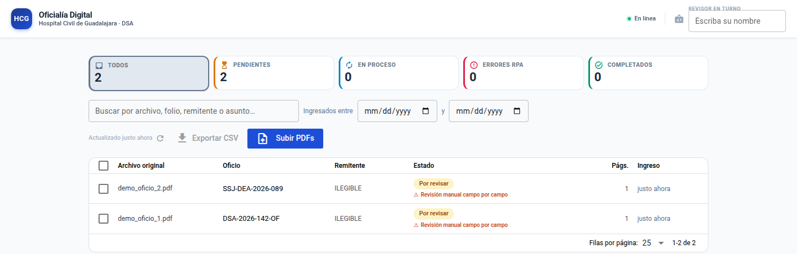
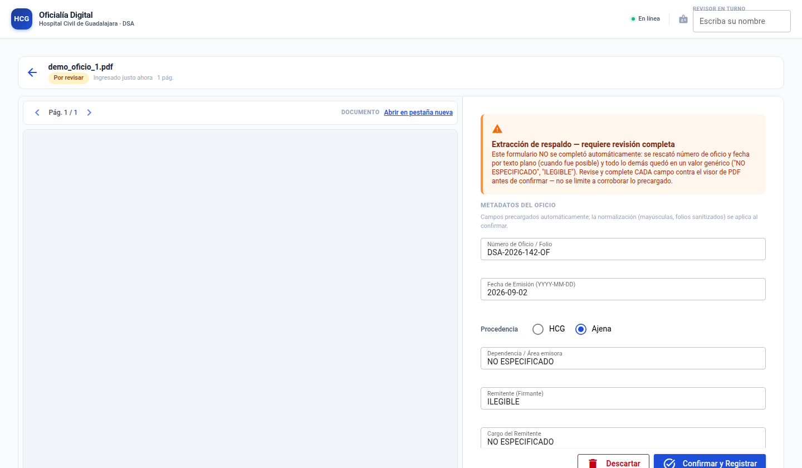
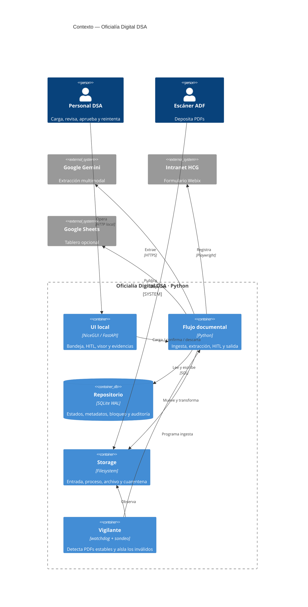
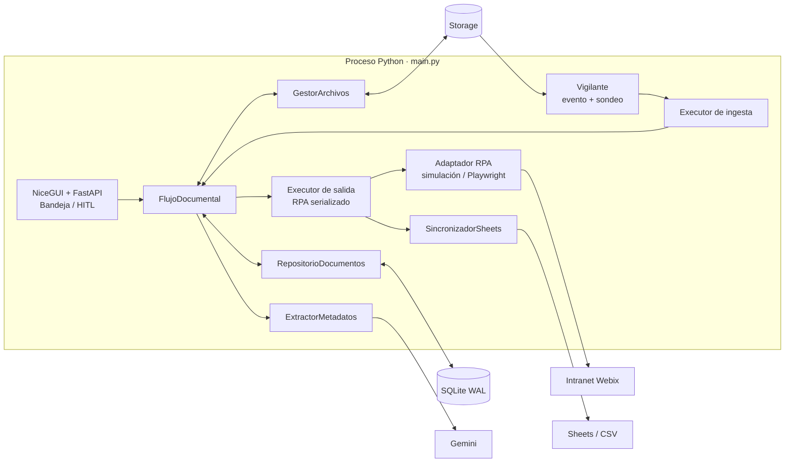
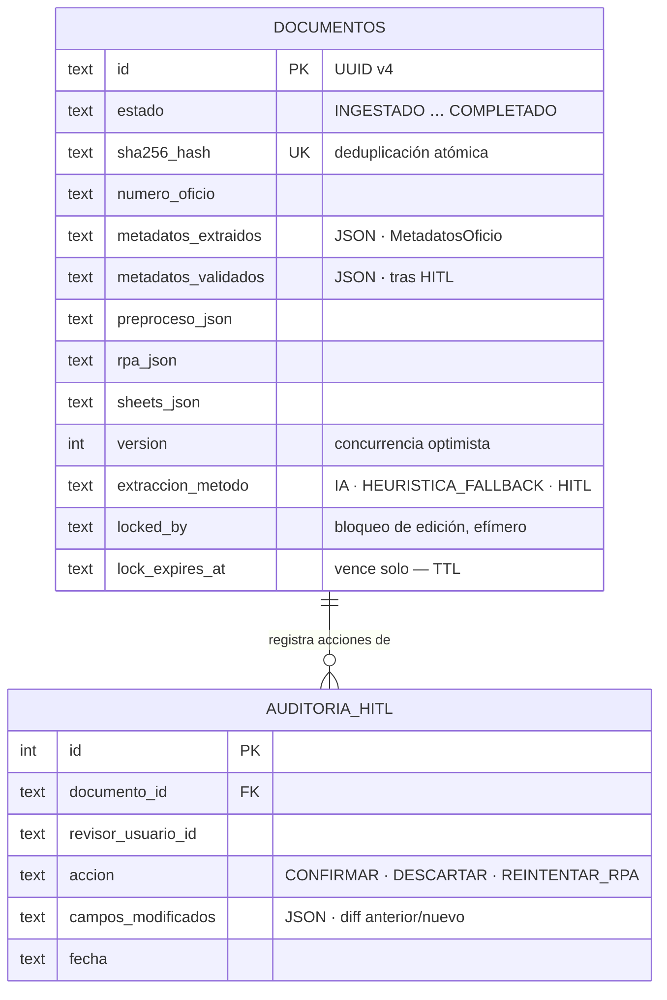
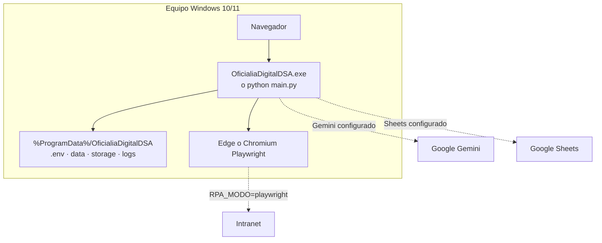
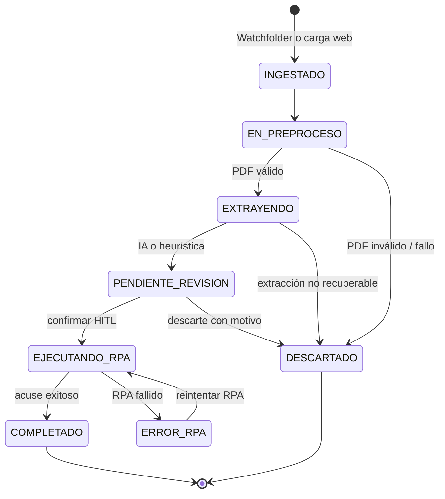
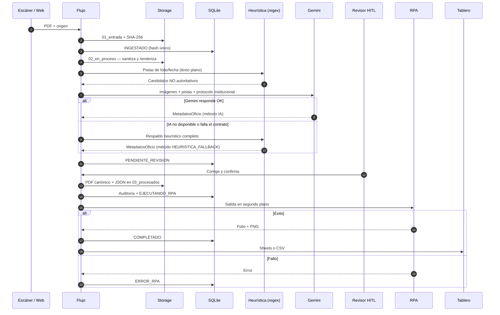
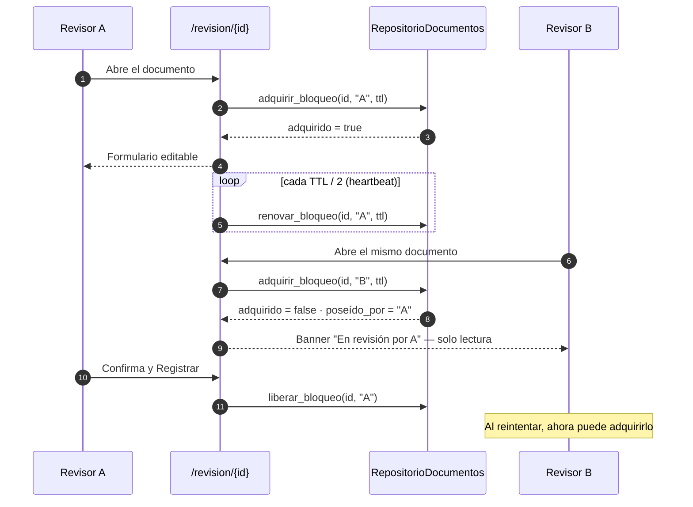
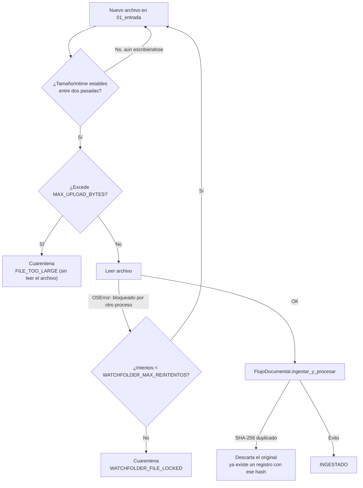

<div align="center">
  
  <h1>Oficialía Digital DSA</h1>
  <p><strong>Recepción, extracción, revisión y registro trazable de oficios PDF.</strong></p>
  <p>
    
    
    
    
    
    
  </p>
</div>

> [!IMPORTANT]
> **Uso interno.** Plataforma para la División de Servicios Administrativos (DSA) del Hospital Civil de Guadalajara. Proteja los PDFs, evidencias y credenciales conforme a la política institucional.

## Vistazo

<table>
<tr>
<td width="50%" valign="top">

<p align="center"><sub><strong>Bandeja</strong> — las tarjetas KPI son el único selector de estado (sin pestañas duplicadas), con buscador, rango de fechas y exportación a CSV en una sola barra de herramientas.</sub></p>
</td>
<td width="50%" valign="top">

<p align="center"><sub><strong>Revisión HITL</strong> — split-screen 50/50: visor de PDF persistente a la izquierda, formulario precargado y banners de contexto a la derecha.</sub></p>
</td>
</tr>
</table>

## Índice

- [Qué hace el sistema](#1-qué-hace-el-sistema)
- [Propósito](#propósito)
- [Arquitectura](#arquitectura)
  - [Contexto y contenedores](#contexto-y-contenedores)
  - [Componentes, aislamiento y concurrencia](#componentes-aislamiento-y-concurrencia)
  - [Modelo de datos](#modelo-de-datos)
  - [Despliegue](#despliegue)
- [Ciclo de vida](#ciclo-de-vida)
  - [Bloqueo de edición concurrente en HITL](#bloqueo-de-edición-concurrente-en-hitl)
  - [Endurecimiento de la ingesta](#endurecimiento-de-la-ingesta)
  - [Controles de fiabilidad](#controles-de-fiabilidad)
- [Inicio rápido](#inicio-rápido)
- [Configuración](#configuración)
- [Uso de la interfaz y rutas locales](#uso-de-la-interfaz-y-rutas-locales)
- [Operación](#operación)
- [Pruebas y empaquetado](#pruebas-y-empaquetado)
- [Estructura del repositorio](#estructura-del-repositorio)

---

## 1. Qué hace el sistema

1. **Ingesta dual de PDFs**: vigilancia automática de `storage/01_entrada/` (escáner ADF, vía
   `watchdog` + sondeo de respaldo) y carga manual por la web (arrastrar y soltar, con diálogo
   dedicado y límite de tamaño visible). Deduplicación **atómica** por SHA-256 — un duplicado
   jamás crea un segundo registro — y, si se detecta, un **diálogo accionable** en la bandeja
   ofrece ir directo al documento ya existente en vez de un aviso pasivo. El vigilante de carpeta
   además **aísla en cuarentena** (sin reintentar para siempre) los archivos que excedan el
   tamaño máximo o que permanezcan bloqueados por otro proceso (antivirus, un recurso SMB que no
   soltó el descriptor) más allá del número de reintentos configurado.
2. **Preprocesamiento** con **PyMuPDF** en memoria: validación de cabecera/contraseña/estructura,
   sanitización del árbol xref, conteo de páginas y renderizado a **PNG @300 dpi** (máx. 10
   páginas por inferencia).
3. **Extracción estructurada en dos fases**, ambas sobre el mismo motor de patrones
   (`core/heuristic_extractor.py`):
   - **Preprocesamiento heurístico** (`extraer_pistas`): localiza por regex, sobre la capa de
     texto embebida del PDF (o el OCR auxiliar si esa capa está vacía), candidatos de número de
     oficio y fecha de emisión — normalización Unicode NFC, alternancia de meses en español,
     resistente a diacríticos descompuestos por OCR/PDF. Esos candidatos viajan al prompt de
     **Gemini 2.5 Flash** (SDK oficial `google-genai`) como pistas **explícitamente no
     autoritativas**: el modelo debe confirmarlas o refutarlas contra la imagen, sin que se
     relaje el refuerzo anti-alucinación del system prompt institucional (protocolo OCR de
     oficios, 9 secciones). La salida se fuerza a JSON y se valida en estricto con
     **Pydantic v2** (`MetadatosOficio`, 11 campos).
   - **Respaldo de último recurso** (`extraer_heuristico`): si la IA no está disponible (sin API
     key, cuota agotada, timeout de red) o su respuesta viola el contrato, el mismo motor de
     patrones produce un `MetadatosOficio` completo con placeholders explícitos, marcado
     `HEURISTICA_FALLBACK`, para que el documento llegue de todos modos a
     `PENDIENTE_REVISION` — nunca se pierde en cuarentena solo por un fallo transitorio de la IA.
4. **Ciclo de vida persistido en SQLite (WAL)**:
   `INGESTADO → EN_PREPROCESO → EXTRAYENDO → PENDIENTE_REVISION → EJECUTANDO_RPA → COMPLETADO`
   (con `ERROR_RPA` reinteligible y `DESCARTADO` terminal).
5. **Revisión asistida (HITL)** en la web: bandeja con **tarjetas KPI que son a la vez el único
   selector de estado** (Todos / Pendientes / En proceso / Errores RPA / Completados — sin una
   fila de pestañas duplicada), buscador en vivo, **filtro de rango de fechas de ingesta**,
   **exportación a CSV** de la vista filtrada y **split-screen 50/50** — visor de PDF a la
   izquierda, formulario precargado con la IA a la derecha. El nombre del revisor persiste por
   navegador entre la bandeja y cada revisión (no hay que reescribirlo en cada oficio). Acciones:
   **[Confirmar y Registrar]**, **[Descartar]**, **[Reintentar RPA]** y, sobre la bandeja,
   **[Confirmar seleccionados]** para aprobar en lote varios documentos `PENDIENTE_REVISION` a la
   vez tal cual los extrajo la IA (excluye automáticamente los de extracción heurística, que
   exigen edición manual). Un documento extraído por el respaldo heurístico muestra un banner de
   advertencia imposible de ignorar. Un **bloqueo de edición con TTL y heartbeat** evita que dos
   revisores editen el mismo oficio a la vez sin saberlo: quien llega después ve de inmediato
   quién lo tiene y el formulario en solo lectura, sin perder su corrección.
6. **Al confirmar**: renombrado canónico `YYYY-MM-DD__[FOLIO]__[REMITENTE].pdf` en
   `storage/03_procesados/YYYY/MM/` + **respaldo espejo `.json`** + verificación de hash
   post-escritura + **registro de auditoría** (quién confirmó/descartó/reintentó, qué campos
   corrigió respecto de lo extraído — visible como historial en la pantalla de revisión).
7. **RPA con Playwright**: inyección del oficio en la Intranet Webix (`op_cucs.fwx` → iframe
   `op_ningr.fwx`), subida del PDF canónico, captura del **folio de acuse** y screenshot de
   evidencia. Navegador `RPA_NAVEGADOR=auto` (default): usa el Microsoft Edge ya instalado en
   Windows 10/11 sin descargar nada, y solo si no está disponible cae al Chromium empaquetado por
   el instalador. Modo dual `RPA_MODO=simulacion|playwright` y `RPA_HEADLESS=false` para ver el
   navegador.
8. **Sincronización opcional a Google Sheets** (cuenta de servicio) con el layout A:M del tablero
   de control; sin credenciales funciona en **stub local** (`data/sheets_backup.csv`).
9. **Exportación a carpeta compartida de red (SMB)**: al confirmar en HITL, copia (best-effort,
   nunca bloquea el flujo) el PDF canónico a `SMB_EXPORT_DIR` con nombre dinámico
   `{folio}_{fecha}_{remitente}_{asunto}.pdf`; un fallo de permisos o de red en el recurso
   compartido solo queda registrado en el log.
10. **Operación diagnosticable**: log rotativo a archivo (`logs/app.log`, 10 MB × 5 respaldos,
    `core/logging_setup.py`) además de la consola, y esquema SQLite versionado
    (`PRAGMA user_version` + migraciones incrementales en `database.py`) para que actualizar la
    app sobre una instalación existente no corrompa ni pierda la base de datos de un cliente.

---

## Propósito

**Oficialía Digital DSA** es un monolito web local de un solo proceso. Recibe oficios por una carpeta vigilada o la interfaz web, los valida y extrae, pide validación humana (**HITL**), registra los aprobados por RPA y publica un tablero opcional.

| Capacidad | Diseño | Resultado |
|---|---|---|
| 📥 Ingesta | `watchdog` + carga NiceGUI | Escáner ADF o navegador; deduplicación por SHA-256, límite de tamaño y cuarentena por bloqueo de archivo en ambos canales. |
| 🧾 PDF | PyMuPDF + Pillow | Validación, sanitización, render limitado y OCR auxiliar opcional. |
| 🧠 Extracción | Gemini + Pydantic v2 | Contrato de 11 campos; pistas heurísticas previas + fallback heurístico completo sobre texto/OCR. |
| 👤 HITL | Bandeja + visor 50/50 | Corrección, confirmación individual/lote, descarte auditable y exportación CSV. |
| 🔒 Concurrencia | Bloqueo con TTL + heartbeat | Dos revisores no editan el mismo oficio a la vez sin saberlo. |
| 🤖 RPA | Playwright o simulación | Registro en Webix, folio de acuse y captura de evidencia. |
| 📊 Tablero | Google Sheets o CSV | La tabulación no bloquea ni revierte un documento completado. |

## Arquitectura

### Contexto y contenedores



### Componentes, aislamiento y concurrencia



Cada operación de base de datos usa una conexión SQLite corta. WAL, `busy_timeout`, hash único y
concurrencia optimista por `version` resguardan las actualizaciones entre hilos. La salida
serializa RPA para no competir por sesión/navegador. El bloqueo de edición HITL (ver
[abajo](#bloqueo-de-edición-concurrente-en-hitl)) es una capa aparte y deliberadamente ortogonal:
nunca toca `version`, así que un heartbeat cada pocos segundos no puede chocar con una escritura
de contenido real en vuelo.

### Modelo de datos

Dos tablas: `documentos` concentra el ciclo de vida completo (metadatos, preproceso, RPA, Sheets
y bloqueo embebidos como columnas o JSON, para evitar joins en la consulta más caliente del
sistema — la bandeja) y `auditoria_hitl` registra cada acción humana con el diff campo a campo
respecto de lo extraído automáticamente.



El esquema se versiona con `PRAGMA user_version`: cada arranque aplica las migraciones
pendientes en orden (`database.py::_MIGRACIONES`) sin recrear ni perder la base de datos de una
instalación existente — así se agregaron, sin downtime, la tabla de auditoría (v1→v2) y las
columnas de bloqueo (v2→v3).

### Despliegue



En desarrollo los datos viven en la raíz del repositorio. El ejecutable PyInstaller usa `%ProgramData%\OficialiaDigitalDSA` y reserva `%LOCALAPPDATA%` si la primera ruta no es escribible.

## Ciclo de vida





### Bloqueo de edición concurrente en HITL

Un "bloqueo" aquí es una advertencia temprana en la UI, no un mutex de base de datos: nunca
reemplaza la concurrencia optimista por `version` (esa sigue siendo la garantía real contra
escrituras perdidas), solo evita que dos revisores lleguen a chocar sin saberlo.



Si A simplemente cierra la pestaña sin confirmar ni descartar, `Client.on_disconnect` libera el
bloqueo igual — B no queda esperando un TTL completo salvo que A pierda la conexión sin avisar.

| Directorio | Uso | Artefactos |
|---|---|---|
| `storage/01_entrada/` | Aterrizaje | PDF original temporal. |
| `storage/02_en_proceso/` | Exclusión de proceso | `<uuid>.pdf`. |
| `storage/03_procesados/YYYY/MM/` | Archivo aprobado | PDF canónico, JSON espejo y evidencias. |
| `storage/04_errores/` | Cuarentena | PDF y `<archivo>.error.txt` sellado. |

### Endurecimiento de la ingesta

El canal `SCANNER_ADF` (carpeta vigilada) no tiene un formulario web que valide nada antes de que
el archivo llegue a disco, así que el vigilante (`core/watcher.py`) aplica sus propios controles
antes de entregarle el archivo al pipeline:



El chequeo de tamaño usa el tamaño ya confirmado por el propio sondeo de estabilidad, sin releer
el archivo completo a memoria solo para rechazarlo; el de bloqueo reutiliza el mismo contador
acotado que protege los fallos de ingesta, así que un bloqueo *permanente* (permisos, un proceso
que nunca suelta el archivo) también termina aislado en vez de reintentar para siempre en
silencio.

### Controles de fiabilidad

| Riesgo | Control |
|---|---|
| Doble ingreso | SHA-256 + `UNIQUE`; el duplicado se aísla y la UI ofrece ir al documento existente. |
| Archivo bloqueado (watchfolder) | Reintento acotado (`WATCHFOLDER_MAX_REINTENTOS`) y luego cuarentena — nunca reintenta para siempre. |
| Archivo sobredimensionado | `MAX_UPLOAD_BYTES` se aplica en ambos canales (web y watchfolder); el watchfolder no llega a leerlo. |
| IA no disponible | Reintentos y luego heurística completa, excepto bloqueos de seguridad del proveedor. |
| Datos heurísticos | La interfaz los identifica con un banner; nunca entran en confirmación por lote. |
| Edición simultánea | Bloqueo con TTL + heartbeat en HITL; se libera al confirmar/descartar o al perder la conexión. |
| Fallo RPA | `ERROR_RPA` conserva contexto y permite reintento sin reextraer. |
| Fallo Sheets | No revierte `COMPLETADO`; se persiste el resultado o se usa CSV local. |
| Trazabilidad | Auditoría HITL, JSON espejo, cuarentena y evidencias. |

> [!WARNING]
> No hay autenticación propia de aplicación. Ejecute en una estación/red controlada y mantenga `.env`, SQLite, PDFs y capturas fuera de repositorios públicos. Use `RPA_MODO=simulacion` hasta homologar el formulario institucional.

## Inicio rápido

**Requisitos:** Python 3.11+, `pip`, y una clave Gemini solo si se desea extracción IA. Chromium/Edge es necesario únicamente para RPA real.

```bash
python -m venv .venv
source .venv/bin/activate                 # Linux/macOS
# .venv\Scripts\Activate.ps1              # Windows PowerShell
python -m pip install --upgrade pip
pip install -r requirements.txt
touch .env                                 # En Windows, cree .env manualmente
python main.py
```

Abra `http://localhost:8080`. Sin configuración externa, el modo predeterminado es RPA simulado y tablero CSV local.

```dotenv
# .env mínimo
GEMINI_API_KEY=pegue_su_clave
RPA_MODO=simulacion
WATCHFOLDER_ENABLED=true
```

## Configuración

Copie [`.env.example`](.env.example) a `.env`; `config.py` es la fuente única de configuración. Las variables no reconocidas se ignoran. No incluya secretos en el control de versiones.

| Grupo | Variables principales | Predeterminado / efecto sin configurar |
| --- | --- | --- |
| Interfaz | `APP_HOST`, `APP_PORT`, `MAX_UPLOAD_BYTES`, `STORAGE_SECRET` | `0.0.0.0`, `8080`, 25 MiB; `STORAGE_SECRET` firma la sesión de navegador (`app.storage.user`) que recuerda el "Revisor en turno" entre páginas — no protege ningún límite de seguridad (LAN sin autenticación) |
| Datos | `DATABASE_PATH`, `STORAGE_ROOT` | `data/oficialia.db` y `storage/` |
| IA | `GEMINI_API_KEY`, `GEMINI_MODELO`, `GEMINI_TIMEOUT_MS`, `GEMINI_REINTENTOS`, `RENDER_DPI`, `RENDER_MAX_PAGINAS` | Sin `GEMINI_API_KEY`, el documento se descarta de forma trazable; modelo `gemini-2.5-flash` |
| Watchfolder | `WATCHFOLDER_ENABLED`, `WATCHFOLDER_INTERVALO_MS`, `WATCHFOLDER_ESTABILIDAD_MS`, `WATCHFOLDER_MAX_REINTENTOS` | Activo, sondeo de respaldo cada 5 s; el mismo tope de reintentos cubre fallos de ingesta y archivos bloqueados |
| Revisión HITL | `HITL_LOCK_TTL_MIN` | 3 minutos — vencimiento del bloqueo de edición si el revisor cierra la pestaña sin confirmar ni descartar |
| RPA | `RPA_MODO`, `RPA_HEADLESS`, `RPA_TIMEOUT_MS`, `RPA_REINTENTOS`, `RPA_SIMULACION_FALLAR` | `playwright` (real) en esta instalación; fije `RPA_MODO=simulacion` para pruebas locales sin navegador |
| Intranet | `INTRANET_BASE_URL`, `INTRANET_HTTP_USERNAME`, `INTRANET_HTTP_PASSWORD`, `RPA_USUARIO`, `RPA_PASSWORD`, `RPA_OFICIALIA_CVE`, `RPA_HCG_DEPENDENCIA_CVE`, `RPA_SECCION_CVE` | URL institucional configurada en la plantilla; `RPA_USUARIO`/`RPA_PASSWORD` son la cuenta institucional para el login SII/Webix (usadas como HTTP credentials si `INTRANET_HTTP_USERNAME`/`PASSWORD` se omiten) |
| Resiliencia RPA | `RPA_SELECTOR_TIMEOUT_MS`, `RPA_WEBIX_INIT_TIMEOUT_MS`, `RPA_REINTENTO_BASE_MS`, `RPA_REINTENTO_MAX_MS`, `RPA_SESSION_TTL_MIN`, `RPA_JITTER_FACTOR` | Valores seguros internos de `config.py` |
| Exportación SMB | `SMB_EXPORT_DIR` | Copia best-effort del PDF canónico a la carpeta de red al confirmar en HITL; vacío desactiva la exportación |
| Sheets | `GOOGLE_SHEETS_SPREADSHEET_ID`, `GOOGLE_SHEETS_SHEET_NAME`, `GOOGLE_SERVICE_ACCOUNT_JSON` | Sin destino o credenciales se escribe `data/sheets_backup.csv` |

También se admite `GOOGLE_APPLICATION_CREDENTIALS`, o un archivo `credentials.json` junto a los datos de la app, para señalar credenciales de Google fuera del `.env`. Configure al menos `GEMINI_API_KEY` para pasar de ingesta a revisión; para producción, reemplace además `[CONFIGURAR_CREDENCIALES_RPA]` y `[CONFIGURAR_CUENTA_SERVICIO_SHEETS]` según corresponda.

> **Secretos**: `GEMINI_API_KEY`, `RPA_PASSWORD` y `GOOGLE_SERVICE_ACCOUNT_JSON` no tienen valor por
> defecto en `config.py` ni en `.env.example` (ambos se versionan en git) — captúrelos únicamente
> en su `.env` local, que ya está en `.gitignore`.

## Uso de la interfaz y rutas locales

1. Deposite un PDF en `storage/01_entrada/` o cárguelo desde el botón **Subir PDFs** de la bandeja.
2. Espere a que alcance `PENDIENTE_REVISION` y abra la revisión (las tarjetas KPI filtran la vista).
3. Corrija y confirme los campos extraídos, o descarte el documento con un motivo. Si otro revisor ya lo tiene abierto, el formulario se muestra en solo lectura con su nombre visible.
4. Tras confirmar, supervise el resultado `COMPLETADO` o `ERROR_RPA`; este último se puede reintentar sin repetir la extracción.
5. Exporte a CSV la vista filtrada actual (buscador, rango de fechas y estado aplicados) para bitácoras de turno.

Las rutas HTTP están destinadas al visor interno de NiceGUI:

| Ruta | Respuesta |
| --- | --- |
| `/` | Bandeja y carga manual de documentos. |
| `/revision/{doc_id}` | Visor PDF y formulario HITL del documento. |
| `/pdf/{doc_id}` | El PDF vigente o `404`. |
| `/evidencia/{doc_id}` | Captura PNG del acuse RPA o `404`. |

Ejemplos de consulta local, usando un identificador existente:

```bash
python -m playwright install chromium
```

Durante homologación, use navegador visible y valide el acuse antes de automatizar sin supervisión.

## Operación

1. Inicie la app y compruebe en `logs/app.log` la carpeta de datos y modos activos.
2. Deposite PDFs en `01_entrada` o cárguelos desde la bandeja.
3. Revise **Pendientes**; toda extracción heurística exige verificación manual.
4. Confirme para archivar PDF/JSON y encolar RPA; los lotes aceptan solo extracción IA.
5. Atienda **Errores RPA** con URL, credenciales, CVE o selectores corregidos y reintente.
6. Respalde `data/`, `storage/` y `logs/` según la política institucional.

| Síntoma | Acción |
|---|---|
| IA descarta | Revise clave, conectividad y log; sin texto extraíble el fallback puede no ser suficiente. |
| Watchfolder inactivo | Confirme permisos, `WATCHFOLDER_ENABLED=true` y estabilidad del archivo. |
| Archivo aislado del watchfolder | Revise `<archivo>.error.txt` en `04_errores`: `FILE_TOO_LARGE` (ajuste `MAX_UPLOAD_BYTES`) o `WATCHFOLDER_FILE_LOCKED` (permisos/antivirus del origen). |
| `ERROR_RPA` | Valide URL/credenciales/CVE y cambios Webix con `RPA_HEADLESS=false`. |
| "En revisión por…" no se libera | El TTL (`HITL_LOCK_TTL_MIN`) vence solo; si persiste, confirme que quien lo tenía perdió la conexión sin cerrar sesión. |
| Sin Google Sheets | Revise permisos y Service Account; sin configuración el CSV local es el resultado esperado. |

## Pruebas y empaquetado

```bash
pip install -r requirements.txt -r requirements-dev.txt
pytest -q
```

La suite (142 pruebas, 11 módulos) cubre configuración, modelos, SQLite/migraciones (incluido el
bloqueo de edición concurrente), preprocesamiento y validación de PDF, el motor heurístico
(pistas de preprocesamiento y respaldo completo), el ensamblado del prompt de IA (bloque de
pistas), el vigilante de carpetas (reintentos, tamaño máximo y cuarentena) y el pipeline
simulado de extremo a extremo; no llama a Gemini ni a la Intranet.

| Módulo | Variable | Valores | Sin configurar |
| --- | --- | --- | --- |
| Extracción IA | `GEMINI_API_KEY` | clave real | **Falla honestamente**: documento en `DESCARTADO` con `AI_NO_CONFIGURADA` y archivo en cuarentena (no hay stub de IA para no falsear datos) |
| RPA | `RPA_MODO` | `simulacion` \| `playwright` | `playwright` en esta instalación; `simulacion`: acuse sintético `HCG-OP-SIM-*`, sin navegador |
| RPA navegador (ventana) | `RPA_HEADLESS` | `false` (visible) \| `true` | `false` — ver el navegador al inyectar |
| RPA navegador (motor) | `RPA_NAVEGADOR` | `auto` \| `msedge` \| `chromium` | `auto` — Edge del sistema primero, Chromium empaquetado como respaldo |
| Forzar fallo RPA simulado | `RPA_SIMULACION_FALLAR` | `true` \| `false` | `false` — útiles para ejercitar `ERROR_RPA` + reintento |
| Exportación SMB | `SMB_EXPORT_DIR` | ruta UNC \| vacío | Copia best-effort del PDF canónico al confirmar en HITL; vacío desactiva la exportación |
| Google Sheets | `GOOGLE_SHEETS_SPREADSHEET_ID` + credenciales | Service Account (JSON en una línea, `GOOGLE_APPLICATION_CREDENTIALS` o `credentials.json`) | **Stub local**: `data/sheets_backup.csv` |
| Watchfolder | `WATCHFOLDER_ENABLED` | `true` \| `false` | `true` |

Layout del tablero de Sheets (fila 1 = encabezados, gestionados por usted; ver
`core/sheets_sync.py::ENCABEZADOS_TABLERO` — es la misma fuente única de verdad que usa el stub
local `data/sheets_backup.csv`):

| A | B | C | D | E | F | G | H | I | J | K | L | M |
|---|---|---|---|---|---|---|---|---|---|---|---|---|
| Fecha registro | ID documento | Folio oficio | Fecha emisión | Procedencia | Dependencia/Área | Remitente | Asunto | Plazo (días) | Datos sensibles | Archivo canónico | Folio acuse RPA | RPA exitoso |

Para generar solamente `dist\OficialiaDigitalDSA` sin requerir Inno Setup:

```powershell
.\packaging\build_windows.ps1
# Solo bundle, sin instalador:
.\packaging\build_windows.ps1 -SinInstalador
```

## Estructura del repositorio

```text
├── main.py                  # Composition root, servidor y ciclo de vida
├── config.py                # Settings y rutas de datos
├── database.py              # SQLite WAL, migraciones, bloqueo y auditoría
├── core/                    # Pipeline, PDF, IA, heurística, storage y watcher
├── rpa/playwright_rpa.py    # Simulación y automatización Webix
├── ui/                      # Bandeja, layout y revisión HITL
├── docs/screenshots/        # Capturas usadas en este README
├── storage/                 # Artefactos operativos ignorados por Git
├── tests/                   # Suite pytest aislada (142 pruebas)
└── packaging/               # PyInstaller e Inno Setup
```

---

<div align="center"><strong>Licencia:</strong> propiedad intelectual de la División de Servicios Administrativos del Hospital Civil de Guadalajara. Uso interno restringido.</div>
