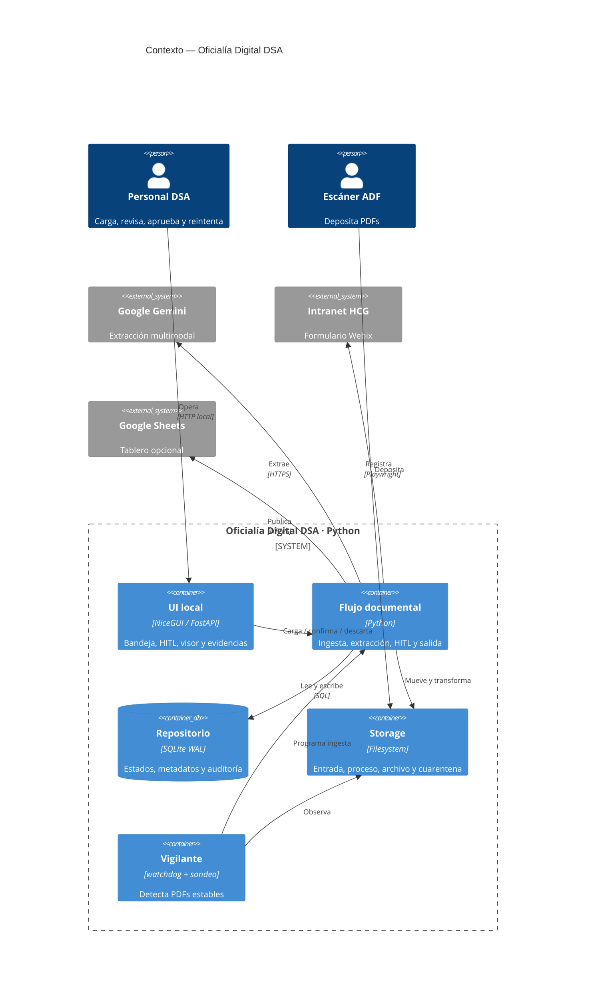
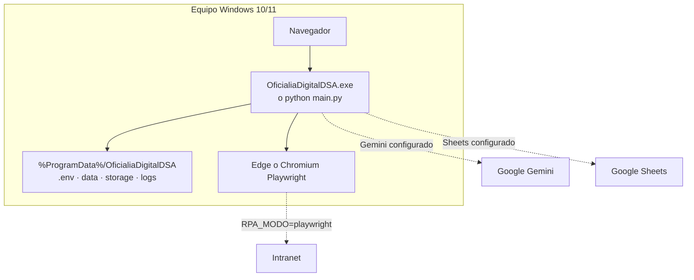
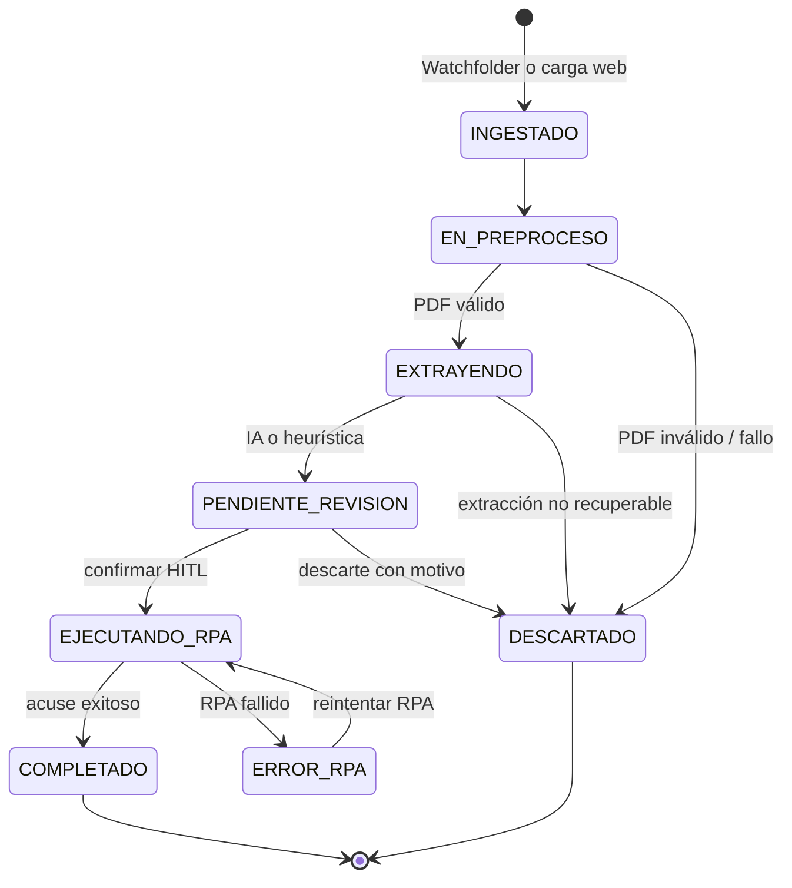

<div align="center">
  
  <h1>Oficialía Digital DSA</h1>
  <p><strong>Recepción, extracción, revisión y registro trazable de oficios PDF.</strong></p>
  <p>
    
    
    
    
    
  </p>
</div>

> [!IMPORTANT]
> **Uso interno.** Plataforma para la División de Servicios Administrativos (DSA) del Hospital Civil de Guadalajara. Proteja los PDFs, evidencias y credenciales conforme a la política institucional.

## Índice

- [Propósito](#propósito) · [Arquitectura](#arquitectura) · [Ciclo de vida](#ciclo-de-vida) · [Inicio rápido](#inicio-rápido) · [Configuración](#configuración) · [Operación](#operación) · [Pruebas y empaquetado](#pruebas-y-empaquetado)

## Propósito

**Oficialía Digital DSA** es un monolito web local de un solo proceso. Recibe oficios por una carpeta vigilada o la interfaz web, los valida y extrae, pide validación humana (**HITL**), registra los aprobados por RPA y publica un tablero opcional.

| Capacidad | Diseño | Resultado |
|---|---|---|
| 📥 Ingesta | `watchdog` + carga NiceGUI | Escáner ADF o navegador; deduplicación por SHA-256. |
| 🧾 PDF | PyMuPDF + Pillow | Validación, sanitización, render limitado y OCR auxiliar opcional. |
| 🧠 Extracción | Gemini + Pydantic v2 | Contrato de 11 campos; fallback heurístico sobre texto/OCR. |
| 👤 HITL | Bandeja + visor 50/50 | Corrección, confirmación individual/lote y descarte auditable. |
| 🤖 RPA | Playwright o simulación | Registro en Webix, folio de acuse y captura de evidencia. |
| 📊 Tablero | Google Sheets o CSV | La tabulación no bloquea ni revierte un documento completado. |

## Arquitectura

### Contexto y contenedores



### Componentes, aislamiento y concurrencia

```mermaid
flowchart LR
  subgraph Process[Proceso Python · main.py]
    UI[NiceGUI + FastAPI\nBandeja / HITL]
    W[Vigilante\nevento + sondeo]
    I[Executor de ingesta]
    P[FlujoDocumental]
    O[Executor de salida\nRPA serializado]
    R[RepositorioDocumentos]
    F[GestorArchivos]
    A[ExtractorMetadatos]
    X[Adaptador RPA\nsimulación | Playwright]
    Y[SincronizadorSheets]
  end
  PDF[(Storage)] --> W --> I --> P
  UI --> P
  P <--> F <--> PDF
  P <--> R <--> DB[(SQLite WAL)]
  P --> A --> G[Gemini]
  P --> O --> X --> N[Intranet Webix]
  O --> Y --> T[Sheets / CSV]
```

Cada operación de base de datos usa una conexión SQLite corta. WAL, `busy_timeout`, hash único y concurrencia optimista por `version` resguardan las actualizaciones entre hilos. La salida serializa RPA para no competir por sesión/navegador.

### Despliegue



En desarrollo los datos viven en la raíz del repositorio. El ejecutable PyInstaller usa `%ProgramData%\OficialiaDigitalDSA` y reserva `%LOCALAPPDATA%` si la primera ruta no es escribible.

## Ciclo de vida



```mermaid
sequenceDiagram
  autonumber
  participant E as Escáner / Web
  participant P as Flujo
  participant S as Storage
  participant D as SQLite
  participant G as Gemini / heurística
  participant H as Revisor HITL
  participant R as RPA
  participant T as Tablero
  E->>P: PDF + origen
  P->>S: 01_entrada + SHA-256
  P->>D: INGESTADO (hash único)
  P->>S: 02_en_proceso; sanitiza y renderiza
  P->>G: Extrae metadatos tipados
  G-->>P: IA o fallback
  P->>D: PENDIENTE_REVISION
  H->>P: Corrige y confirma
  P->>S: PDF canónico + JSON en 03_procesados
  P->>D: Auditoría + EJECUTANDO_RPA
  P->>R: Salida en segundo plano
  alt Éxito
    R-->>P: Folio + PNG
    P->>D: COMPLETADO
    P->>T: Sheets o CSV
  else Fallo
    R-->>P: Error
    P->>D: ERROR_RPA
  end
```

| Directorio | Uso | Artefactos |
|---|---|---|
| `storage/01_entrada/` | Aterrizaje | PDF original temporal. |
| `storage/02_en_proceso/` | Exclusión de proceso | `<uuid>.pdf`. |
| `storage/03_procesados/YYYY/MM/` | Archivo aprobado | PDF canónico, JSON espejo y evidencias. |
| `storage/04_errores/` | Cuarentena | PDF y `<archivo>.error.txt` sellado. |

### Controles de fiabilidad

| Riesgo | Control |
|---|---|
| Doble ingreso | SHA-256 + `UNIQUE`; el duplicado se aísla. |
| IA no disponible | Reintentos y luego heurística, excepto bloqueos de seguridad. |
| Datos heurísticos | La interfaz los identifica; nunca entran en confirmación por lote. |
| Fallo RPA | `ERROR_RPA` conserva contexto y permite reintento sin reextraer. |
| Fallo Sheets | No revierte `COMPLETADO`; se persiste el resultado o se usa CSV local. |
| Trazabilidad | Auditoría HITL, JSON espejo, cuarentena y evidencias. |

> [!WARNING]
> No hay autenticación propia de aplicación. Ejecute en una estación/red controlada y mantenga `.env`, SQLite, PDFs y capturas fuera de repositorios públicos. Use `RPA_MODO=simulacion` hasta homologar el formulario institucional.

## Inicio rápido

**Requisitos:** Python 3.11+, `pip`, y una clave Gemini solo si se desea extracción IA. Chromium/Edge es necesario únicamente para RPA real.

```bash
python -m venv .venv
source .venv/bin/activate                 # Linux/macOS
# .venv\Scripts\Activate.ps1              # Windows PowerShell
python -m pip install --upgrade pip
pip install -r requirements.txt
touch .env                                 # En Windows, cree .env manualmente
python main.py
```

Abra `http://localhost:8080`. Sin configuración externa, el modo predeterminado es RPA simulado y tablero CSV local.

```dotenv
# .env mínimo
GEMINI_API_KEY=pegue_su_clave
RPA_MODO=simulacion
WATCHFOLDER_ENABLED=true
```

## Configuración

`config.py` centraliza las variables vía `pydantic-settings`; `.env` está ignorado por Git.

| Área | Variables | Valores / notas |
|---|---|---|
| Interfaz | `APP_HOST`, `APP_PORT`, `MAX_UPLOAD_BYTES` | `0.0.0.0`, `8080`, 25 MiB. |
| Persistencia | `DATABASE_PATH`, `STORAGE_ROOT` | `data/oficialia.db`, `storage/`. |
| IA / render | `GEMINI_*`, `RENDER_DPI`, `RENDER_MAX_PAGINAS` | `gemini-2.5-flash`, 45 s, 2 reintentos, 300 DPI, 10 páginas. |
| Watchfolder | `WATCHFOLDER_*` | Activo; sondeo cada 5 s y verificación de estabilidad. |
| RPA | `RPA_MODO`, `RPA_NAVEGADOR`, `RPA_HEADLESS`, `RPA_*_TIMEOUT_MS` | `simulacion`; `auto`, `msedge` o `chromium`. |
| Intranet | `INTRANET_*`, `RPA_OFICIALIA_CVE`, `RPA_HCG_DEPENDENCIA_CVE`, `RPA_SECCION_CVE` | Necesario para modo real. |
| Tablero | `GOOGLE_SHEETS_*`, `GOOGLE_SERVICE_ACCOUNT_JSON` | JSON inline o `GOOGLE_APPLICATION_CREDENTIALS`; fallback a `data/tablero_local.csv`. |

### RPA real

```dotenv
RPA_MODO=playwright
RPA_NAVEGADOR=auto
RPA_HEADLESS=false
INTRANET_BASE_URL=https://servidor-institucional/ruta
INTRANET_HTTP_USERNAME=usuario
INTRANET_HTTP_PASSWORD=secreto
RPA_OFICIALIA_CVE=clave_institucional
```

```bash
python -m playwright install chromium
```

Durante homologación, use navegador visible y valide el acuse antes de automatizar sin supervisión.

## Operación

1. Inicie la app y compruebe en `logs/app.log` la carpeta de datos y modos activos.
2. Deposite PDFs en `01_entrada` o cárguelos desde la bandeja.
3. Revise **Pendientes**; toda extracción heurística exige verificación manual.
4. Confirme para archivar PDF/JSON y encolar RPA; los lotes aceptan solo extracción IA.
5. Atienda **Errores RPA** con URL, credenciales, CVE o selectores corregidos y reintente.
6. Respalde `data/`, `storage/` y `logs/` según la política institucional.

| Síntoma | Acción |
|---|---|
| IA descarta | Revise clave, conectividad y log; sin texto extraíble el fallback puede no ser suficiente. |
| Watchfolder inactivo | Confirme permisos, `WATCHFOLDER_ENABLED=true` y estabilidad del archivo. |
| `ERROR_RPA` | Valide URL/credenciales/CVE y cambios Webix con `RPA_HEADLESS=false`. |
| Sin Google Sheets | Revise permisos y Service Account; sin configuración el CSV local es el resultado esperado. |

## Pruebas y empaquetado

```bash
pip install -r requirements.txt -r requirements-dev.txt
pytest -q
```

La suite cubre configuración, modelos, SQLite/migraciones, PDF, heurística y pipeline simulado; no llama a Gemini ni a la Intranet.

Para construir en Windows (PyInstaller + Chromium + Inno Setup):

```powershell
.\packaging\build_windows.ps1
# Solo bundle, sin instalador:
.\packaging\build_windows.ps1 -SinInstalador
```

## Estructura del repositorio

```text
├── main.py                  # Composition root, servidor y ciclo de vida
├── config.py                # Settings y rutas de datos
├── database.py              # SQLite WAL, migraciones y auditoría
├── core/                    # Pipeline, PDF, IA, heurística, storage y watcher
├── rpa/playwright_rpa.py    # Simulación y automatización Webix
├── ui/                      # Bandeja, layout y revisión HITL
├── storage/                 # Artefactos operativos ignorados por Git
├── tests/                   # Suite pytest aislada
└── packaging/               # PyInstaller e Inno Setup
```

---

<div align="center"><strong>Licencia:</strong> propiedad intelectual de la División de Servicios Administrativos del Hospital Civil de Guadalajara. Uso interno restringido.</div>
