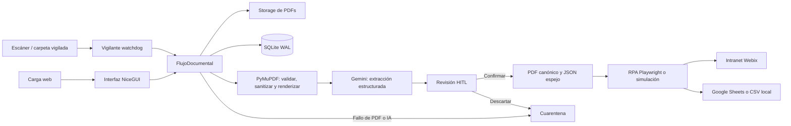
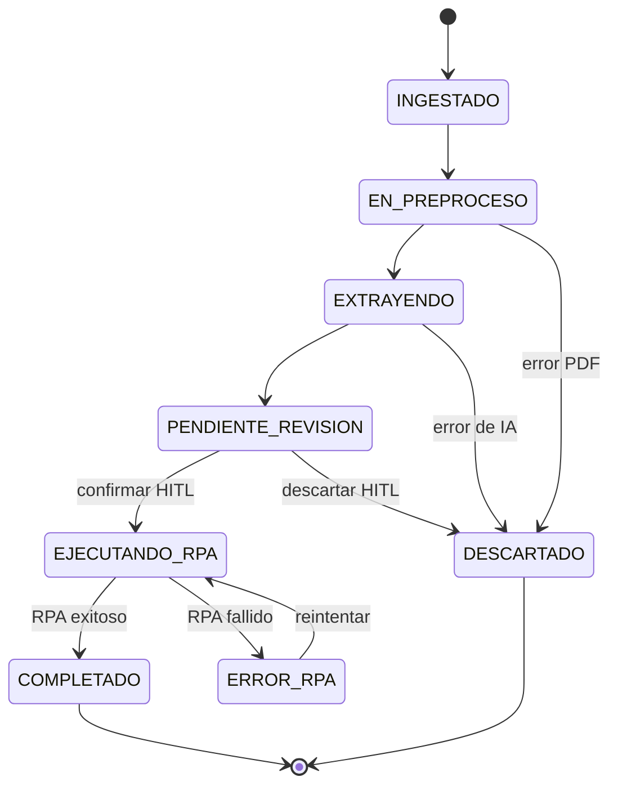

# Oficialía Digital DSA

> Aplicación monolítica en Python para recibir oficios PDF, extraer metadatos con Gemini, revisarlos por una persona y registrarlos mediante RPA.


## Alcance y arquetipo

**Oficialía Digital DSA** es una aplicación web de gestión documental de proceso único. Expone una interfaz NiceGUI y dos rutas HTTP para servir documentos; no ofrece una API pública de integración. Su punto de entrada es [`main.py`](main.py), ejecutado con `python main.py`.

El sistema recibe PDF desde la carga web o desde una carpeta vigilada, valida y renderiza el archivo, solicita metadatos estructurados a Gemini, exige su validación *human-in-the-loop* (HITL), y finalmente registra el oficio mediante RPA o un simulador. SQLite conserva el estado y Google Sheets recibe una réplica no bloqueante cuando el registro RPA tiene éxito.

| Área | Implementación |
| --- | --- |
| Runtime | Python 3.11+ |
| Interfaz y servidor | NiceGUI, FastAPI/Starlette y Uvicorn (dependencias transitivas de NiceGUI) |
| Validación y configuración | Pydantic 2 y pydantic-settings |
| Persistencia | SQLite con WAL |
| Procesamiento PDF | PyMuPDF y Pillow; OCR auxiliar opcional con Tesseract/pytesseract |
| IA | `google-genai`, modelo configurable (por defecto `gemini-2.5-flash`) |
| Automatización | Playwright contra la Intranet Webix, con modo simulación |
| Tablero externo | Google Sheets mediante gspread y una cuenta de servicio |
| Empaquetado Windows | PyInstaller e Inno Setup |

## Arquitectura y flujo operativo



El flujo persiste los documentos y sus metadatos relacionados en una única tabla `documentos`. Las conexiones a SQLite son cortas y configuran WAL, `busy_timeout` y control de concurrencia optimista por versión. El SHA-256 del archivo tiene una restricción única para impedir duplicados entre los canales web y escáner.

### Ciclo de vida



Los archivos recorren `storage/01_entrada`, `storage/02_en_proceso`, `storage/03_procesados` y `storage/04_errores`. La confirmación HITL mueve el PDF a la ubicación canónica y genera su JSON espejo; los errores se aíslan con un archivo `.error.txt` asociado.

## Inicio rápido desde código fuente

### Prerrequisitos

- Python **3.11 o superior** con `venv` y `pip`.
- Una clave de Gemini para completar la extracción real: `[CONFIGURAR_GEMINI_API_KEY]`.
- Solo para `RPA_MODO=playwright`: acceso a la Intranet, credenciales si aplican y Chromium de Playwright.
- Solo para Google Sheets: ID de hoja y credenciales de cuenta de servicio.

### Instalación y ejecución

```bash
python -m venv .venv
source .venv/bin/activate
# En Windows PowerShell: .venv\Scripts\Activate.ps1

pip install -r requirements.txt
cp .env.example .env
python main.py
```

Abra `http://localhost:8080` si conserva el valor predeterminado de `APP_PORT`. La aplicación crea las carpetas de almacenamiento y la base de datos al iniciar.

Para usar automatización real, instale el navegador administrado por Playwright después de instalar las dependencias:

```bash
playwright install chromium
```

En desarrollo, los datos se almacenan bajo la raíz del repositorio. En el ejecutable Windows empaquetado, se usan `%ProgramData%\OficialiaDigitalDSA` o, como reserva, `%LOCALAPPDATA%\OficialiaDigitalDSA`.

## Configuración

Copie [`.env.example`](.env.example) a `.env`; `config.py` es la fuente única de configuración. Las variables no reconocidas se ignoran. No incluya secretos en el control de versiones.

| Grupo | Variables principales | Predeterminado / efecto sin configurar |
| --- | --- | --- |
| Interfaz | `APP_HOST`, `APP_PORT`, `MAX_UPLOAD_BYTES` | `0.0.0.0`, `8080`, 25 MiB |
| Datos | `DATABASE_PATH`, `STORAGE_ROOT` | `data/oficialia.db` y `storage/` |
| IA | `GEMINI_API_KEY`, `GEMINI_MODELO`, `GEMINI_TIMEOUT_MS`, `GEMINI_REINTENTOS`, `RENDER_DPI`, `RENDER_MAX_PAGINAS` | Sin `GEMINI_API_KEY`, el documento se descarta de forma trazable; modelo `gemini-2.5-flash` |
| Watchfolder | `WATCHFOLDER_ENABLED`, `WATCHFOLDER_INTERVALO_MS`, `WATCHFOLDER_ESTABILIDAD_MS`, `WATCHFOLDER_MAX_REINTENTOS` | Activo, sondeo de respaldo cada 5 s |
| RPA | `RPA_MODO`, `RPA_HEADLESS`, `RPA_TIMEOUT_MS`, `RPA_REINTENTOS`, `RPA_SIMULACION_FALLAR` | `simulacion`, sin navegador real |
| Intranet | `INTRANET_BASE_URL`, `INTRANET_HTTP_USERNAME`, `INTRANET_HTTP_PASSWORD`, `RPA_OFICIALIA_CVE`, `RPA_HCG_DEPENDENCIA_CVE`, `RPA_SECCION_CVE` | URL institucional configurada en la plantilla; credenciales y CVE vacíos |
| Resiliencia RPA | `RPA_SELECTOR_TIMEOUT_MS`, `RPA_WEBIX_INIT_TIMEOUT_MS`, `RPA_REINTENTO_BASE_MS`, `RPA_REINTENTO_MAX_MS`, `RPA_SESSION_TTL_MIN`, `RPA_JITTER_FACTOR` | Valores seguros internos de `config.py` |
| Sheets | `GOOGLE_SHEETS_SPREADSHEET_ID`, `GOOGLE_SHEETS_SHEET_NAME`, `GOOGLE_SERVICE_ACCOUNT_JSON` | Sin destino o credenciales se escribe `data/tablero_local.csv` |

También se admite `GOOGLE_APPLICATION_CREDENTIALS` para señalar un archivo de credenciales de Google fuera del `.env`. Configure al menos `GEMINI_API_KEY` para pasar de ingesta a revisión; para producción, reemplace además `[CONFIGURAR_CREDENCIALES_RPA]` y `[CONFIGURAR_CUENTA_SERVICIO_SHEETS]` según corresponda.

## Uso de la interfaz y rutas locales

1. Deposite un PDF en `storage/01_entrada/` o cárguelo en la bandeja de `/`.
2. Espere a que alcance `PENDIENTE_REVISION` y abra la revisión.
3. Corrija y confirme los campos extraídos, o descarte el documento con un motivo.
4. Tras confirmar, supervise el resultado `COMPLETADO` o `ERROR_RPA`; este último se puede reintentar sin repetir la extracción.

Las rutas HTTP están destinadas al visor interno de NiceGUI:

| Ruta | Respuesta |
| --- | --- |
| `/` | Bandeja y carga manual de documentos. |
| `/revision/{doc_id}` | Visor PDF y formulario HITL del documento. |
| `/pdf/{doc_id}` | El PDF vigente o `404`. |
| `/evidencia/{doc_id}` | Captura PNG del acuse RPA o `404`. |

Ejemplos de consulta local, usando un identificador existente:

```bash
curl -OJ http://localhost:8080/pdf/<doc_id>
curl -o acuse.png http://localhost:8080/evidencia/<doc_id>
```

## Construcción del instalador Windows

La distribución para Windows se construye **en Windows**; PyInstaller no realiza compilación cruzada. El script crea un entorno de construcción, instala requisitos y PyInstaller, descarga Chromium, genera el bundle y compila el instalador con Inno Setup.

```powershell
.\packaging\build_windows.ps1
```

Para generar solamente `dist\OficialiaDigitalDSA` sin requerir Inno Setup:

```powershell
.\packaging\build_windows.ps1 -SinInstalador
```

El workflow [`.github/workflows/build-windows-installer.yml`](.github/workflows/build-windows-installer.yml) se ejecuta manualmente o al publicar etiquetas `v*`. Publica el ejecutable como artefacto y lo adjunta a una GitHub Release solo para etiquetas.

## Verificación

El repositorio no declara una suite de pruebas automatizada ni un *linter*. Como verificación mínima del código fuente, ejecute:

```bash
python -m compileall -q config.py main.py database.py core rpa ui
```

La prueba funcional requiere un PDF válido y una configuración de Gemini. Para validar las rutas de salida sin conectar servicios institucionales, conserve `RPA_MODO=simulacion` y deje Google Sheets sin configurar; la extracción sigue requiriendo una clave Gemini válida.

## Estructura del repositorio

```text
main.py                 Punto de entrada, composición y rutas de archivos
config.py               Carga centralizada de .env y rutas de datos
database.py             Esquema SQLite y repositorio de documentos
core/                   Pipeline, PDF, IA, archivos, watcher y Sheets
rpa/                    Adaptadores Playwright y simulación
ui/                     Bandeja y revisión HITL con NiceGUI
storage/                Directorios de tránsito documental versionados vacíos
packaging/              PyInstaller, PowerShell e Inno Setup para Windows
.github/workflows/      Construcción y publicación del instalador
```

## Contribución y operación

1. Cree una rama de trabajo y mantenga los secretos fuera del repositorio.
2. Cambie la configuración únicamente a través de `Configuracion` y `get_settings()`; los módulos no deben leer el entorno directamente.
3. Ejecute la comprobación de compilación antes de abrir una revisión.
4. Para cambios de empaquetado, pruebe el flujo de Windows y verifique tanto la instalación mínima como el componente opcional RPA.

El proceso de despliegue disponible es el workflow de instalador: etiquetas con prefijo `v` producen un release, y las ejecuciones manuales producen un artefacto descargable. No hay infraestructura de despliegue de servidor declarada en este repositorio.

## Licencia

Propiedad intelectual de la División de Servicios Administrativos del Hospital Civil de Guadalajara. Uso interno restringido; no se autoriza su divulgación ni implementación externa.
