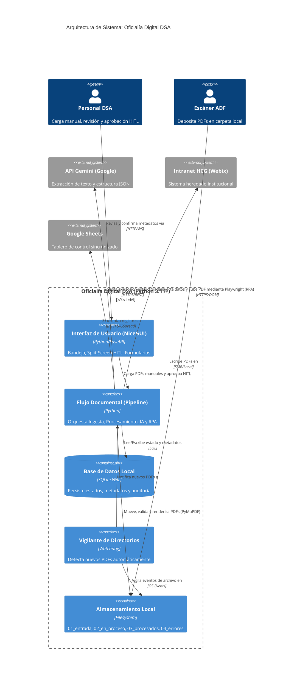
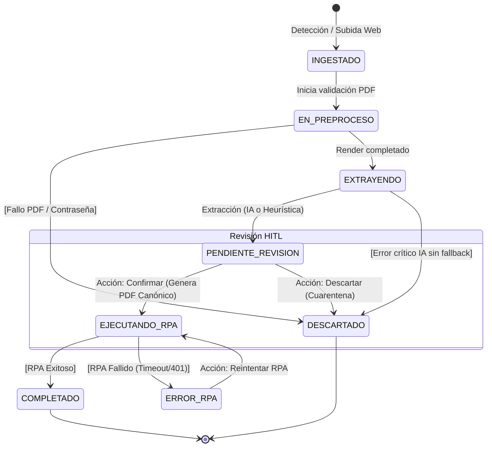
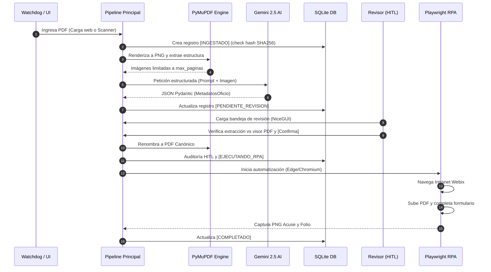

<div align="center">
  
  <h1>Oficialía Digital DSA</h1>
  <p><strong>Middleware de Ingesta, Extracción IA y RPA para Gestión Documental</strong></p>
  <p>
    <a href="#"></a>
    <a href="#"></a>
    <a href="#"></a>
    <a href="#"></a>
    <a href="#"></a>
    <a href="#"></a>
  </p>
  <p><em>Reconstrucción unificada del sistema original (Node.js/Fastify/TypeScript/Svelte 5/WebSockets) en <strong>Python puro</strong>, sin sobreingeniería: un proceso, un comando (<code>python main.py</code>), cero Node.</em></p>
</div>

---

**Institución:** División de Servicios Administrativos (DSA) — Hospital Civil de Guadalajara (HCG).

## 🚀 Funcionalidades Principales

1. 📥 **Ingesta dual de PDFs**: Vigilancia automática de `storage/01_entrada/` (escáner ADF, vía `watchdog`) y carga manual web (drag & drop). Deduplicación **atómica** por SHA-256 para evitar registros dobles.
2. ⚙️ **Preprocesamiento en Memoria**: Uso de **PyMuPDF** para validación de estructura, contraseñas, conteo de páginas y renderizado a **PNG @300 dpi** (máx. 10 páginas por inferencia).
3. 🧠 **Extracción Estructurada con IA**: Integración con **Gemini 2.5 Flash** (vía `google-genai`). Salida JSON forzada y validación estricta con **Pydantic v2** (`MetadatosOficio`, 11 campos). Respaldo heurístico sin red (`core/heuristic_extractor.py`) para rescatar folio/fecha en caso de caída de la IA.
4. 🗄️ **Persistencia Robusta**: SQLite en modo WAL, manejando el ciclo de vida completo del documento: `INGESTADO → EN_PREPROCESO → EXTRAYENDO → PENDIENTE_REVISION → EJECUTANDO_RPA → COMPLETADO`.
5. 👤 **Revisión Asistida (HITL)**: Interfaz web split-screen 50/50. Visor PDF interactivo y formulario autocompletado por IA. Permite revisión rápida, descartes y aprobaciones en lote.
6. 🤖 **RPA con Playwright**: Inyección automática del oficio en la Intranet Webix institucional. Captura de **folio de acuse** y captura de pantalla como evidencia. Modo dual (`simulacion` y `playwright`).
7. 📊 **Sincronización a Google Sheets**: Volcado opcional del tablero de control a Google Sheets vía Service Account. Respaldo local en `data/tablero_local.csv`.

---

## 🏗️ Arquitectura del Sistema

**Oficialía Digital DSA** es una aplicación web monolítica de proceso único. No expone una API pública y se ejecuta localmente mediante `main.py`.

### Diagrama de Arquitectura (C4 Context/Container)



### Ciclo de Vida del Documento (State Machine)



### Flujo Operativo Secuencial (Core Pipeline)



---

## 💻 Instalación y Ejecución

### Opción A: Instalación en Windows (Usuario Final)
Para el personal de la DSA que solo va a usar el sistema en Windows 10/11 sin conocimientos de programación:

1. Ve a la pestaña **[Releases](../../releases)** y descarga **`OficialiaDigitalDSA-Setup.exe`**.
2. Sigue el asistente de instalación. El componente de "Automatización RPA" (navegador Chromium embebido) es opcional si el sistema ya cuenta con Microsoft Edge instalado (`RPA_NAVEGADOR=auto`).
3. Inicia la aplicación desde el acceso directo del Escritorio o el menú Inicio (abre el navegador en `http://127.0.0.1:8080`).
4. Abre **Configuración (.env)** desde el menú Inicio, añade tu `GEMINI_API_KEY` y credenciales de la Intranet, y reinicia la app.

**Nota:** Por defecto el sistema inicia en modo seguro (`RPA_MODO=simulacion`, Sheets local) para explorar y validar sin riesgo de afectar sistemas externos.

### Opción B: Inicio rápido desde código fuente (Desarrollo)

Requisitos: **Python 3.11+**, `venv`, `pip` y una clave de API de Google Gemini.

```bash
# 1. Clonar y crear entorno virtual
python -m venv .venv

# 2. Activar entorno virtual
# Windows: .venv\Scripts\Activate.ps1
# Linux/macOS: source .venv/bin/activate
source .venv/bin/activate

# 3. Instalar dependencias
pip install -r requirements.txt
playwright install chromium  # Requerido solo si se usará Chromium puro

# 4. Configurar entorno
cp .env.example .env
# -> Edite .env y agregue GEMINI_API_KEY

# 5. Ejecutar la aplicación
python main.py
```
> La app creará automáticamente las carpetas `storage/` y el archivo `data/oficialia.db`. Accede a `http://localhost:8080`.

---

## ⚙️ Configuración (`.env`)

Copie `.env.example` a `.env`. Todas las configuraciones se cargan de forma segura a través de `config.py`.

| Grupo | Variables Principales | Valor por Defecto |
| :--- | :--- | :--- |
| **Interfaz** | `APP_HOST`, `APP_PORT`, `MAX_UPLOAD_BYTES` | `0.0.0.0`, `8080`, 25 MiB |
| **Datos** | `DATABASE_PATH`, `STORAGE_ROOT` | `data/oficialia.db`, `storage/` |
| **IA** | `GEMINI_API_KEY`, `GEMINI_MODELO`, `GEMINI_TIMEOUT_MS` | Sin API Key el documento será descartado (o usará heurística si se habilita) |
| **Carpetas** | `WATCHFOLDER_ENABLED`, `WATCHFOLDER_INTERVALO_MS` | Activo, sondeo cada 5s |
| **RPA** | `RPA_MODO`, `RPA_NAVEGADOR`, `RPA_HEADLESS` | `simulacion`, `auto` (Edge preferido), `true` |
| **Intranet** | `INTRANET_BASE_URL`, `INTRANET_HTTP_USERNAME` | URL Institucional, credenciales vacías |
| **Sheets** | `GOOGLE_SHEETS_SPREADSHEET_ID`, `GOOGLE_SERVICE_ACCOUNT_JSON` | Sin destino usa `data/tablero_local.csv` |

---

## 🛠️ Modos de Operación RPA y Diagnóstico

| Variable | Opciones | Comportamiento |
| :--- | :--- | :--- |
| **`RPA_MODO`** | `simulacion` \| `playwright` | En simulación, inyecta acuses sintéticos (`HCG-OP-SIM-*`) sin usar navegador real. Útil para desarrollo local. |
| **`RPA_HEADLESS`** | `false` \| `true` | Si es `false`, levanta la ventana del navegador (Edge/Chromium) permitiendo observar el robot en acción. |
| **`RPA_NAVEGADOR`** | `auto` \| `msedge` \| `chromium` | `auto` intenta usar el Edge nativo del SO para no requerir descargas pesadas de binarios Playwright. |

### 🔧 Solución de Problemas (Troubleshooting)

* **Documentos en `DESCARTADO` por `AI_NO_CONFIGURADA`:** Falta establecer la `GEMINI_API_KEY`.
* **Error de Intranet (HTTP 401):** Credenciales de `INTRANET_HTTP_USERNAME` / `PASSWORD` incorrectas. Si usa NTLM, verifique la configuración institucional en Playwright.
* **Timeout Webix (`FORMULARIO_WEBIX_TIMEOUT`):** Los selectores de DOM o IDs de Webix han cambiado en la intranet. Validar interfaz RPA en `rpa/playwright_rpa.py`.
* **No carga el Watchfolder en SMB (Red):** Verifique que `WATCHFOLDER_ENABLED=true`. Existe un loop de respaldo secundario (cada 5 seg) que intentará leer los archivos independientemente del OS Event.

---

## 🧪 Pruebas y Desarrollo

El sistema incluye una suite ligera y completamente aislada:

```bash
pip install -r requirements-dev.txt
pytest -q
```
* **Aislamiento Total:** Cada prueba levanta una base de datos temporal y un sistema de archivos en memoria. No realiza llamadas reales a Gemini ni levanta el navegador de Playwright (usa mocks y dobles).
* **Cobertura:** Pydantic (modelos de datos), SQLite (optimistic concurrency, migraciones), procesador PyMuPDF, y el pipeline completo simulado.

### Empaquetado para Windows (Construcción del .exe)
La distribución instalable usa `PyInstaller` e `Inno Setup`. Ejecutar **en Windows**:

```powershell
.\packaging\build_windows.ps1
```
> O genera solo el binario sin el instalador Setup: `.\packaging\build_windows.ps1 -SinInstalador`

---

## 📂 Estructura del Repositorio

```text
├── main.py                  # Entrypoint, composición FastAPI/NiceGUI
├── config.py                # Pydantic Settings, entorno unificado
├── database.py              # SQLite CRUD, Migraciones, Repositorio
├── core/
│   ├── ai_extractor.py      # Puente Gemini API
│   ├── file_manager.py      # Gestión de Storage / Deduplicación
│   ├── heuristic_extractor.py # Respaldo Regex Offline (Fallback)
│   ├── models.py            # Esquemas Pydantic / Constantes Estado
│   ├── pdf_engine.py        # PyMuPDF: Sanitización y Rasterizado
│   ├── pipeline.py          # Orquestador del flujo
│   ├── sheets_sync.py       # Puente GSpread
│   └── watcher.py           # Watchdog de Ingesta ADF
├── rpa/
│   └── playwright_rpa.py    # Automatización y simulación Intranet Webix
├── ui/
│   ├── layout.py            # Envoltura de interfaz NiceGUI
│   ├── views_dashboard.py   # Bandeja de operaciones y grilla
│   └── views_hitl.py        # Split-Screen HITL revisión manual
├── storage/                 # Volúmenes de datos locales en ejecución
└── packaging/               # Scripts PyInstaller / Inno Setup para CI/CD
```

---

<div align="center">
  <p><strong>Licencia:</strong> Propiedad intelectual de la División de Servicios Administrativos del Hospital Civil de Guadalajara. Uso interno restringido; no se autoriza su divulgación ni implementación externa.</p>
</div>